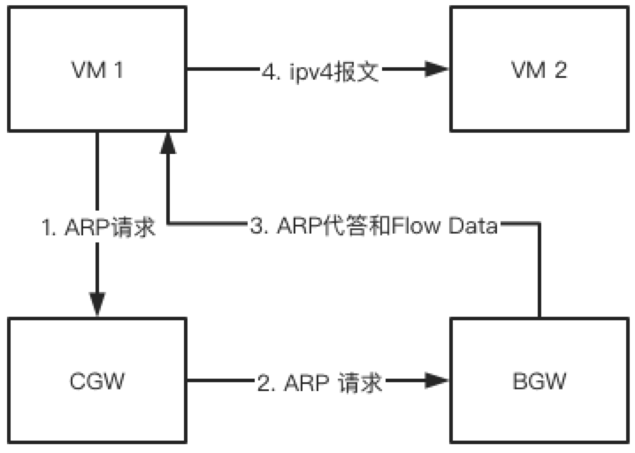
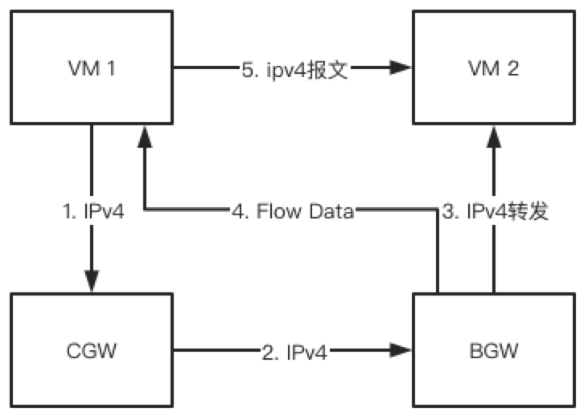
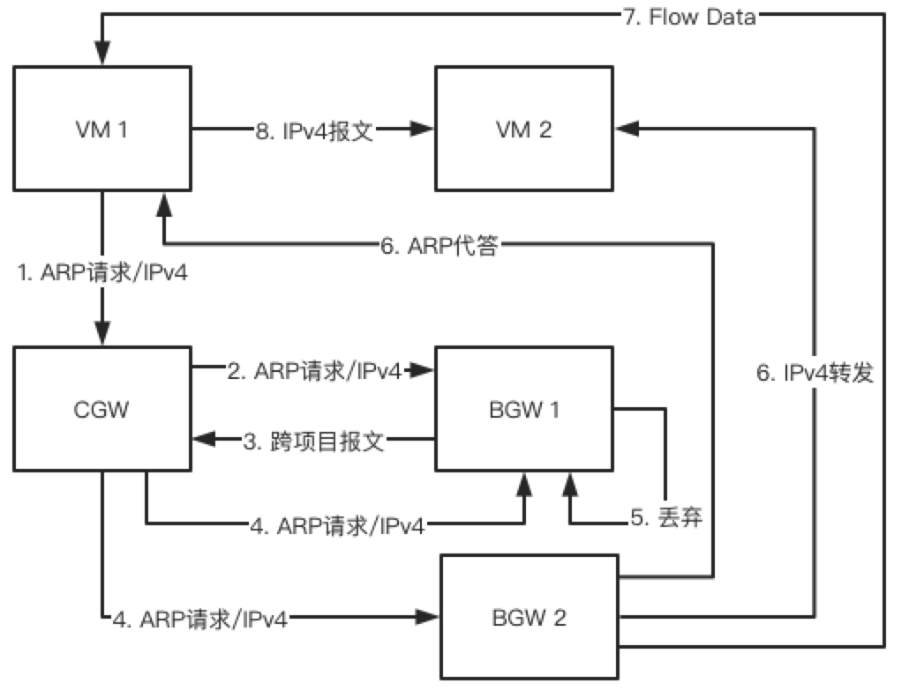
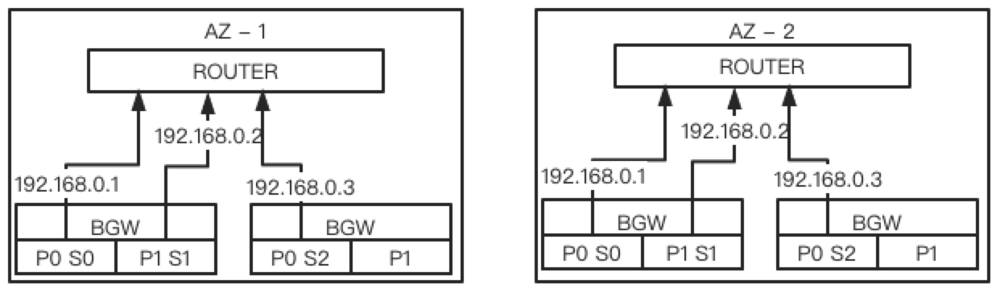
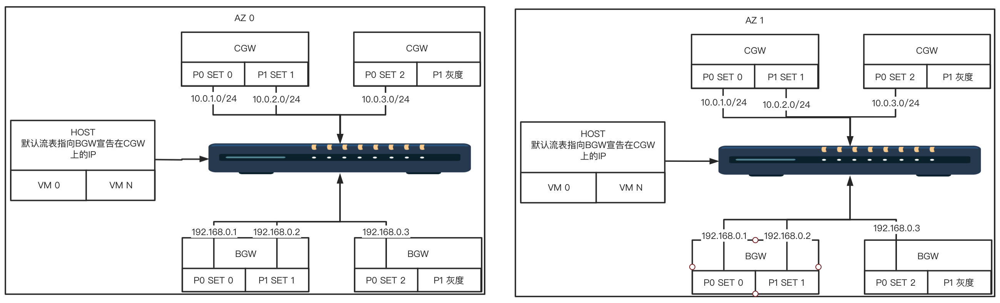
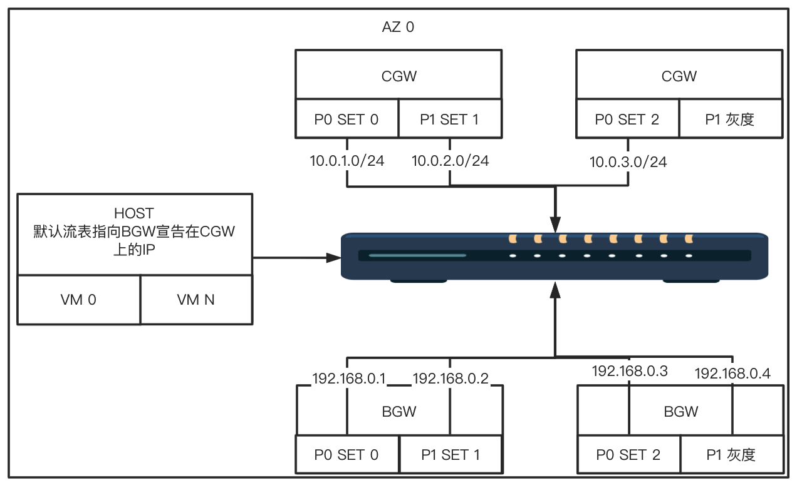

# BGW 设计

## 前言

BGW有一个用于上线和灰度的BGP测试地址

## P4

如下图所示：每台P4交换机分为多个pipeline(32口2个pipeline，64口4个pipeline)；os；bfswitch；bf-sde和gobgp
    

1. pipeline：每个pipeline可以理解为一台虚拟的P4设备
2. bfswitch：与管理平台对接，用于P4设备上下线。例如给P4设备配置BGP，设置pipeline，配置端口online等
3. bf-sde：转发面相关逻辑在此处处理，同时提供了grpc等接口给控制台调用实现读写流表等操作
4. gobgp：与物理网络构建BGP，将VIPs宣告出去

## 背景

1. VPC 2.0首包上Controller
   * 首包延迟大，被客户挑战（有赞，UK8S）
   * 控制面性能不足
     * 轻微：URouteManager超时，用户有丢包
     * 严重：数据库被打爆，所有新增flow无法通信
2. VPC 3.0，尝试使用主动推送flow方式将全量数据下发到宿主机
   * 数据量大，仍以有赞为例，VPC内约有1万IP，flow需要4、5万条
   * OVS下发速度约1万条/秒
   * 新建VM在5s内仍会碰到首包延迟问题，后续会稳定，比VPC 2.0有改进

## 主要功能点

1. 支持报文类型
   * IP版本
     * underlay支持IPV4
     * overlay支持IPV4
   * 封装
     * GRETAP
     * VXLAN
     * GRETAP与VXLAN互转
   * 支持报文大于MTU时回ICMP报文，用于虚机间协商MTU
   * TTL小于2，BGW回ICMP报文，用于虚机trace route
   * 不支持报文重组
2. 表项数
   * 20万VM IPV4
   * 17万VM MAC
   * 万VNI
   * 1.2万公共服务IPV4
   * 1万公共服务MAC 
   * 2.5万dpid
3. 同子网
   * 源VM发出ARP查询报文，OVS发现本地没有转发至CGW
   * CGW按照分片规则发送给指定的bgw分片
   * bgw进行ARP代答并生成flow data报文返回源宿主机，OVS通过learn生成流表
   * 后续IPV4报文命中流表，直接发送至对端VM
     
4. 跨子网，同VPC
   * 源VM发出IPV4报文，OVS发现本地没有转发至CGW
   * CGW按照分片规则发送给指定的bgw分片
   * bgw转发IPV4报文并生成flow data报文返回源宿主机，OVS通过learn生成流表
   * 后续IPV4报文命中流表，直接发送至对端VM
     
5. 跨项目(网段相同VNI不同)
   * 源VM发出ARP/IPV4报文, OVS发现本地没有转发至CGW
   * CGW按照分片规则发送给指定的bgw分片
   * bgw发现为跨项目互通, 按照跨项目打通关系复制对应份的报文修改VNI并将源信息填至underlay ipv4 option中发送至CGW
   * CGW按照分片原则发送给指定的bgw分片
   * bgw收到不需要处理的报文则丢弃
   * bgw收到需要助理的报文后则提取underlay ipv4 option中的源信息并进行ARP代答或IPV4报文转发；同时生成flow data报文发送至源宿主机，OVS通过learn生成流表
   * 后续报文命中流表，直接发送至对端VM
     
6. 公共服务
   * 由于与公共服务通信时使用的VNI均为VM归属的VNI，故在bgw中查询的表项为单独表项，且公共服务部分不支持分片
   * 查好表项后参见同子网和跨子网同VPC处理逻辑

## 周边服务

1. bfswitch： 与管理平台对接，主要用于设备上下线
2. bgwmgr：监听resource-service等服务获取cgw分片规则以及VPC相关数据，最终转换成转发面流表下发至bgw设备
3. bgw-dbcheck： 验证bgw的流表是否符合预期
4. bgw-fwdcheck： 验证bgw的转发行为是否符合预期

## 部署

如下图所示bgw支持跨AZ容灾
    
结合CGW的部署图如下
    

1. bgw按SET进行水平扩容
2. 每个SET在不同AZ内最少有一台虚拟bgw设备，即一个pipeline，为分配的pipeline用于后续灰度
3. 每个虚拟bgw设备均与物理网络建立BGP，且每个SET下的所有虚拟bgw均宣告相同的BGP地址
4. 物理网络保证就近接入

## 上线

1. 安装ONL, 参见https://ushare.ucloudadmin.com/pages/viewpage.action?pageId=31077704中的第5、6步
2. 安装bf-sde以及bfswitch（bfswitch有默认的pipeline）
3. 根据物理连线情况调用bfswitch的SetPorts、SetHostInterfaces、SetBGPConfig、SetBGPNetworks和SetVRFs接口设置端口、BGP以及VRF信息。其中VRF用于隔离pipeline、BGP用于与物理网络建立BGP并宣告VIP、端口用于设置端口速率等。**此处的BGP地址为BGP测试地址**
4. 调用bfswitch的SetOnlineInfos对该设备进行上线
5. 通过ping测试BGP连通性以及有效性。若BGP地址ping不通可ssh上机器通过gobgp相关命令查询bgp邻居状态或抓包进行排查
6. 调用bfswitch的SetPipeline接口设置pipeline后调用ReStart重启bfswitch（pipeline的p4name不能与上一个版本相同）
7. 调用bfswitch的SetConfig接口设置bfswitch的配置，若不调用则使用bfswitch的默认配置
8. 有以下几种上线情况
   - 地域上线BGW集群步骤如下：
     - 上线bgwmgr(每个pipeline一个POD)、bgw-dbcheck(每个pipeline一个POD)和bgw-fwdcheck(每个   BGW-SET一个POD, 后续考虑每个AZ中的每个cgw-set一个POD)
     - 调用cgw-service的AllocateVips为bgw集群申请一个或多个VIP
     - 调用bfswitch的SetBGPNetworks设置BGP地址(物理网络提供)
     - 调用bfswitch的SetOnlineInfos将bgw设备上线
     - 通过ping测试BGP连通性以及有效性。若BGP地址ping不通可ssh上机器通过gobgp相关命令查询bgp邻居状态或抓包进行排查
     - 调用CreateRedirectCluster创建bgw集群
     - 若创建集群时未填写分片规则或灰度规则可调用AddShardingRule和AddCanaryRule进行配置
     - 按照分片规则为每个VM调用bgw-checktool验证bgw转发行为
     - 业务将路由指向从cgw-service申请出的VIP
   - 上线BGW-SET步骤如下：
     - 上线bgwmgr(每个pipeline一个POD)、bgw-dbcheck(每个pipeline一个POD)和bgw-fwdcheck(每个   BGW-SET一个POD, 后续考虑每个AZ中的每个cgw-set一个POD)
     - 调用cgw-service的AllocateVips为bgw集群申请一个或多个VIP
     - 调用bfswitch的SetBGPNetworks设置BGP地址(物理网络提供)
     - 调用bfswitch的SetOnlineInfos将BGW设备上线
     - 通过ping测试BGP连通性以及有效性。若BGP地址ping不通可ssh上机器通过gobgp相关命令查询bgp邻居状态或抓包进行排查
     - 调用UpdateRedirectCluster为BGW集群添加一个subset ip(物理网络提供给BGW的IP)
     - 调用AddCanaryRule以VM为粒度灰度到新的BGW-SET(每灰度一个VM需要调用bgw-checktool验证BGW转发行为;CGW可支持先按明细值灰度, 最大256条; 再按/24位掩码聚合, 最后512条规则, 可支持128K台VM;灰度完一个VNI下的所有VM后先为该VNI配置分片规则再将其灰度规则删除)
   - 上线BGW设备步骤如下：
     - 上线bgwmgr(每个pipeline一个POD)、bgw-dbcheck(每个pipeline一个POD)
     - 调用bfswitch的SetBGPNetworks设置BGP地址(物理网路提供, 每个BGW-SET下的BGW设备的BGP地址相同)
     - 调用bfswitch的SetOnlineInfos将BGW设备上线
     - 通过ping测试BGP连通性以及有效性。若BGP地址ping不通可ssh上机器通过gobgp相关命令查询bgp邻居状态或抓包进行排查

## 下线

1. 下线一台BGW设备：下线对应的bgw-dbcheck、bgwmgr;调用bfswitch的SetOnlineInfos接口对该设备进行下线，待BGP状态切换成非Established时即下线成功
2. 下线BGW-SET：通过灰度规则/分片规则将流量移到其他的BGW-SET;下线对应的bgw-dbcheck、bgwmgr、bgw-fwdcheck;调用cgw-service的UpdateRedirectCluster删除该BGW-SET;调用bfswitch的SetOnlineInfos对设备进行下线，待BGP状态切换成非Established时即下线成功
3. 下线整个地域的BGW：将业务移走;调用cgw-service相关接口删除对应RedirectCluster并调用ReleaseVIP释放宣告在cgw上的VIP;调用bfswitch的SetOnlineInfos对设备进行下线，待BGP状态切换成非Established时即下线成功

## 灰度

如下图所示每个AZ最少留一个pipeline用于bgw灰度

1. 上线新bgw分片设备、待VIP（图中的192.168.0.4）宣告成功后进行下一步操作
2. 上线bgwmgr
3. 上线bgw-dbcheck
4. 上线bgw-fwdcheck
5. 调用cgw-service的UpdateRedirectCluster新增一个subset（图中的192.168.0.4）
6. 先按照VM粒度灰度到新的bgw集群（每次灰度均需要调用cgw-checktool来验证是否转发至新的bgw分片，同时调用bgw-checktool来验证bgw流量是否转发正常），后聚合成一个子网。依次类推，直到需要灰度的分片所有流量均灰度到新bgw分片时可进行bgw分片下线操作后下线的bgw分片作为新的分片用于灰度
7. 每个操作均需要观察bgw-dbcheck以及bgw-fwdcheck是否有新告警
