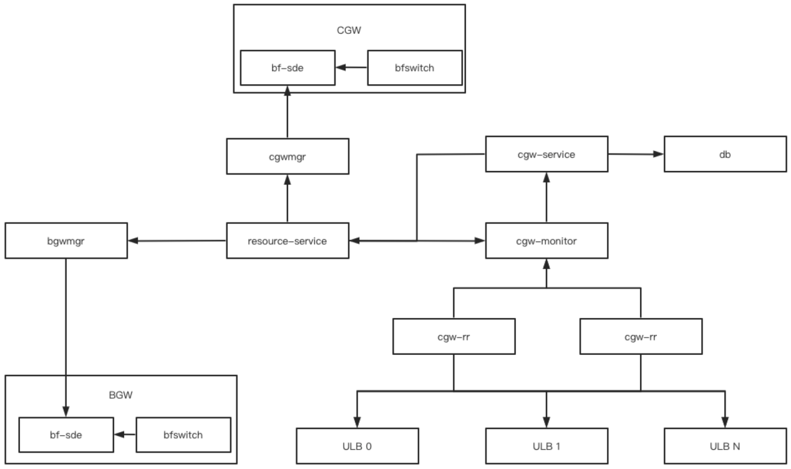
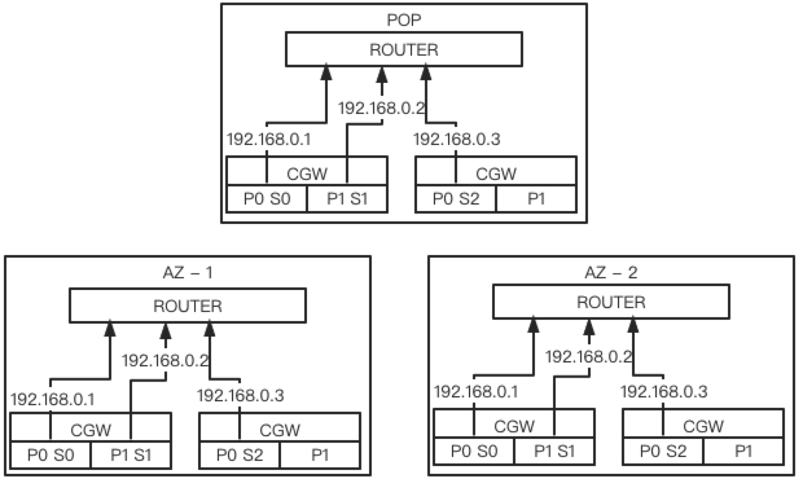
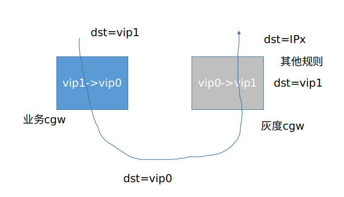

# CGW设计

## 前言

CGW有一个用于上线和灰度的BGP测试地址

## P4

如下图所示：每台P4交换机分为多个pipeline(32口2个pipeline，64口4个pipeline);os;bfswitch;bf-sde和gobgp
    

1. pipeline：每个pipeline可以理解为一台虚拟的P4设备
2. bfswitch：与管理平台对接，用于P4设备上下线。例如给P4设备配置BGP，设置pipeline，配置端口online等
3. bf-sde：转发面相关逻辑在此处处理，同时提供了grpc等接口给控制台调用实现读写流表等操作
4. gobgp：与物理网络构建BGP，将VIPs宣告出去

## 主要功能

1. 自身分片：自身分片通过与物理网络建立BGP实现, 即: 每个CGW SET下的pipeline均宣告相同的BGP地址
2. 引流
   * 宣告明细VIP引流
   * 多个POP点或多AZ多台服务器组成一个集群, 实现负载和就近接入
3. 支持报文类型
   * IP版本
     * underlay：IPV4
     * overlay：IPV4和IPV6
   * 封装
     * GRETAP
     * VXLAN
   * 不支持报文长度大于MTU回ICMP报文
   * TTL小于2，CGW回ICMP报文，用于虚机trace route
   * 不支持报文重组
4. 业务集群分片
   * 分片以VPC为粒度，将流量分发到分片对应的其他VIP，其他VIP可以是CGW管理的也可以不是CGW管理的
   * 根据明细值识别S级客户最大支持512条明细分片规则，其他客户按前缀指定分片规则，最大支持128条分片规则
   * IPV4：根据VNI识别VPC。例如：BGW明细VNI和VNI段
   * IPV6：按照源地址或者目的地址的第32到64位识别VPC。例如：BGW的IPV6目的地址；UVER 2.0的IPv6源地址，把/40的地址按/46的前缀分为64条分片规则
5. ECMP
   * 一致性HASH集群
     * CGW根据收到报文中的外层目的IP选择集群,单台设备支持128个一致性哈希集群
     * hash算法支持Maglev Hashing变种，转发表大小为16K，后端服务器最多支持32个
     * hash字段支持VNI和内层源IP、目的IP、源端口、目的端口
       * l3(0): 忽略源和目的端口
       * l3_src(1): 忽略源和目的端口和目的IP
       * l3_dst(2): 忽略源和目的端口和源IP
       * l4(3): 
       * l4_src(4): 忽略目的端口和目的IP
       * l4_dst(5): 忽略源端口和源IP
     * 后端服务器通过BGP协议和ClusterGW通信，宣告VIP。宣告相同VIP的后端服务器组成一个集群。后端服务器本地执行健康检查，检测到异常停止BGP宣告
   * 普通哈希集群
     * CGW根据收到报文中的外层目的IP选择集群,单台设备支持128个普通哈希集群
     * hash算法采用CRC32取模，转发表大小为1K，后端服务器最多支持32个
     * hash字段支持VNI和内层源IP、目的IP、源端口、目的端口字段
       * l3(0): 
       * l3_src(1):
       * l3_dst(2):
       * l4(3):
       * l4_src(4):
       * l4_dst(5):
     * 后端服务器通过BGP协议和ClusterGW通信，宣告VIP。宣告相同VIP的后端服务器组成一个集群。后端服务器本地执行健康检查，检测到异常停止BGP宣告
6. 灰度
   * 灰度发布支持VM为粒度, 将流量分发到指定分片对应的其他VIP, 其他VIP可以是CGW管理的也可以不是CGW管理的
   * 一般可以先按明细值灰度, 最大256条; 再按/24位掩码聚合, 最后512条规则, 可支持128K台VM
   * IPV4：根据VNI识别VPC。例如BGW的明细VNI以及VNI段
   * IPV6：源地址或者目的地址的第32到64位识别子网，再按第96到128位识别VM（灰度粒度有误差可以接受）。例如源IP第32到64位+第96到128

## 周边服务

1. cgw-service：接收管理平台对本地域cgw进行管理. 其中包含VIP、SET、分片集群、ECMP集群、device等. cgw-service将接收到的请求持久化在DB的同时将事件写入resource-service
2. resource-service：将写入的事件做缓存并通知给watch了它的所有服务
3. cgwmgr：watch resource-service接收cgw-service的配置变更后并通过调用bf-sde的grpc接口下发给对应cgw设备
4. cgw-dbcheck：验证p4设备流表是否符合预期
5. cgw-fwdcheck：验证p4设备转发是否符合预期
6. cgw-checktool：提供给其他服务进行特定VM的转发正确性验证工具
7. cgw-rr：与ECMP集群的业务设备建立BGP并将BGP状态同步给cgw-monitor
8. cgw-monitor：收到cgw-rr的BGP变更后同步给cgw-service
    

## 部署

如下图所示cgw支持跨AZ容灾
    

1. CGW按SET进行水平扩容
2. 每个SET在不同AZ内最少有一台虚拟CGW设备，即一个pipeline. POP点根据实际情况选择是否需要放置
3. 每个虚拟CGW设备均与物理网络建BGP。且每个SET下的所有虚拟CGW设备均宣告相同的BGP地址
4. 物理网络保证就近接入CGW设备

## 上线

1. 安装ONL, 参见https://ushare.ucloudadmin.com/pages/viewpage.action?pageId=31077704中的第5、6步
2. 安装bf-sde以及bfswitch(bfswitch有默认的pipeline)
3. 根据物理连线情况调用bfswitch的SetPorts、SetHostInterfaces、SetBGPConfig、SetBGPNetworks和SetVRFs接口设置端口、BGP以及VRF信息。其中VRF用于隔离pipeline、BGP用于与物理网络建立BGP并宣告VIP、端口用于设置端口速率等。**此处的BGP地址为BGP测试地址**
4. 调用bfswitch的SetOnlineInfos对该设备进行上线
5. 通过ping测试BGP连通性以及有效性。若BGP地址ping不通可ssh上机器通过gobgp相关命令查询bgp邻居状态或抓包
6. 调用bfswitch的SetPipeline接口设置pipeline后调用ReStart重启bfswitch(pipeline的p4name不能与上一个版本相同)
7. 调用bfswitch的SetConfig接口设置bfswitch的配置，若不调用则使用bfswitch的默认配置
8. 有以下几种上线情况
   - 地域上线CGW集群步骤如下：
     - 调用bfswitch的SetBGPNetworks修改VIPs为物理网络分配的BGP地址
     - 调用bfswitch的SetOnlineInfos对该设备进行上线
     - 通过ping测试BGP连通性以及有效性。若BGP地址ping不通可ssh上机器通过gobgp相关命令查询bgp邻居状态或抓包
     - 上线cgw-service、cgwmgr(每个pipeline一个POD)、resource-service(若有则不需要上线操作)、cgw-monitor(若无ECMP集群需求可暂不上线)、cgw-rr(若无ECMP集群需求可暂不上线)
     - 调用cgw-service的CreateDevice、CreateSet、CreateVips(CGW-SET级别)以及CreateDevicePorts(可以调用bfswitch的GetPortsPhyInfo获取端口IP、MAC和GW_MAC等信息)对cgw-set以及device进行配置
     - 调用cgw-service的AllocateVips为业务集群申请VIP
     - 调用cgw-service的CreeateRedirectCluster/CreateECMPCluster创建Redirect/ECMP集群
     - 若调用创建集群时未创建分片规则或ECMP members可调用UpdateECMPCluster/AddShardingRule/AddCanaryRule等接口更新ECMP集群/添加分片规则/添加灰度规则
     - 上线cgw-dbcheck(每个pipeline一个POD)和cgw-fwdcheck(每个cgw-set一个POD, 后续考虑每个AZ中的每个cgw-set一个POD)
     - 为每条规则调用cgw-checktool进行转发行为验证
     - 业务将路由指向从cgw-service申请出的VIP
   - 上线CGW-SET步骤如下：
     - 调用bfswitch的SetBGPNetworks修改VIPs为物理网络分配的BGP地址
     - 通过ping测试BGP连通性以及有效性。若BGP地址ping不通可ssh上机器通过gobgp相关命令查询bgp邻居状态或抓包
     - 上线cgwmgr(每个pipeline一个POD)、cgw-monitor(若无ECMP集群需求可暂不上线)、cgw-rr(若无ECMP集群需求可暂不上线)
     - 调用cgw-service的CreateDevice、CreateSet、CreateVips(CGW-SET级别)以及CreateDevicePorts(可以调用bfswitch的GetPortsPhyInfo获取端口IP、MAC和GW_MAC等信息)对cgw-set以及device进行配置
     - 调用cgw-service的AllocateVips为业务集群申请VIP
     - 调用cgw-service的CreeateRedirectCluster/CreateECMPCluster创建Redirect/ECMP集群
     - 若调用创建集群时未创建分片规则或ECMP members可调用UpdteECMPCluster/AddShardingRule/AddCanaryRule等接口更新ECMP集群/添加分片规则/添加灰度规则
     - 上线cgw-dbcheck(每个pipeline一个POD)和cgw-fwdcheck(每个cgw-set一个POD, 后续考虑每个AZ中的每个cgw-set一个POD)
     - 为每条规则调用cgw-checktool进行转发行为验证
     - 业务将路由指向从cgw-service申请出的VIP
   - 上线CGW设备步骤如下：
     - 上线cgwmgr(每个pipeline一个POD)、cgw-monitor(若无ECMP集群需求可暂不上线)、cgw-rr(若无ECMP集群需求可暂不上线)
     - 调用cgw-service的CreateDevice以及CreateDevicePorts(可以调用bfswitch的GetPortsPhyInfo获取端口IP、MAC和GW_MAC等信息)对cgw-set以及device进行配置
     - 上线cgw-dbcheck(每个pipeline一个POD)
     - 调用bfswitch的SetBGPNetworks修改VIPs为物理网络分配的BGP地址
     - 调用bfswitch的SetOnlineInfos对该设备进行上线
     - 通过ping测试BGP连通性以及有效性。若BGP地址ping不通可ssh上机器通过gobgp相关命令查询bgp邻居状态或抓包

## 下线

1. 下线一台CGW设备：下线对应的cgw-dbcheck、cgwmgr;调用DeleteDevicePort以及DeleteDevice删除CGW设备;调用bfswitch的SetOnlineInfos对该设备进行下线，待BGP状态切换成非Established时即下线成功
2. 下线CGW-SET：将该CGW-SET下的业务移走;下线对应的cgw-dbcheck、cgwmgr、cgw-fwdcheck;调用DeleteRedirectCluster/DeleteECMPCluster删除Redirect/ECMP集群;调用ReleaseVip以及DeleteVip删除VIP;调用DeleteDevicePort以及DeleteDevice删除CGW设备;调用DeleteSet删除CGW-SET;调用bfswitch的SetOnlineInfos对设备进行下线，待BGP状态切成非Established时即下线成功
3. 下线整个地域的CGW：将CGW下的业务移走;下线整个地域的cgw周边服务(例如cgw-dbcheck、cgw-fwdcheck等);调用bfswitch的SetOnlineInfos对设备进行下线，待BGP状态切换成非Established时即下线成功;清空CGW数据库

## 灰度

如下图所示每个AZ最少留一个pipeline用于bgw灰度

1. 上线一个用于灰度的CGW-SET(拥有需要灰度的CGW-SET的所有集群信息以及规则)，并宣告出用于灰度的BGP地址
2. 在需要灰度的CGW-SET里调用cgw-service的AddCanaryRule以VM为粒度将流量导入用于灰度的CGW-SET
3. 待需要灰度的CGW-SET的所有流量均导入到用户灰度的CGW-SET后进行如下操作(此处需要考虑是以CGW-SET为单位进行切换还是以业务集群为单位进行切换, 比较偏向以业务集群为单位进行切换)
   - 将原CGW-SET的BGP地址加到用于灰度的CGW-SET中
   - 删除原CGW-SET的BGP地址宣告
   - 删除用于灰度的CGW-SET上的用于灰度的BGP地址
   - 将原CGW-SET作为新的用于灰度的CGW-SET