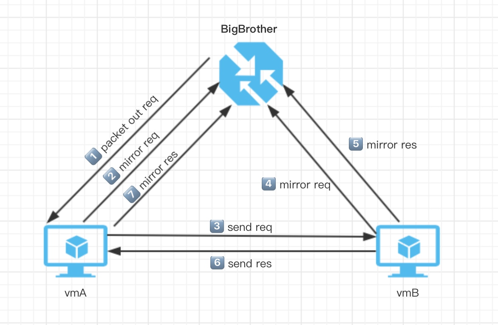
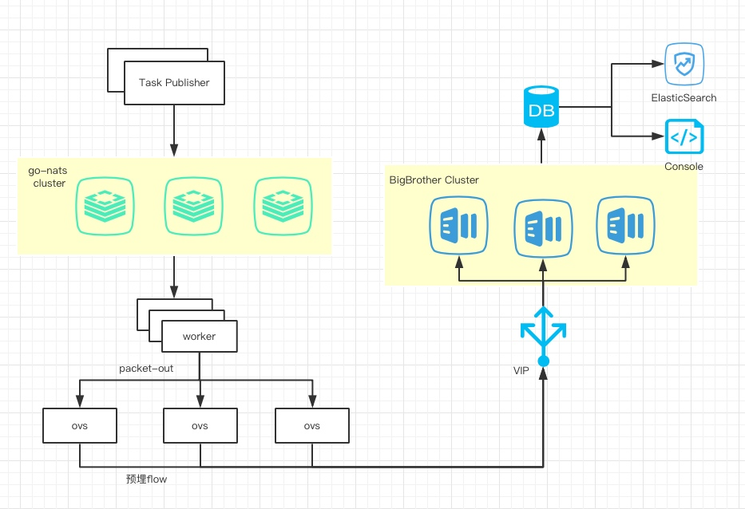

# BigBrother方案设计v2：基于ToS染色的单边注包

<p align="right"><font color=Grey>try.chen 2018-11-03</font></p>

## 概述

`BigBrother`是一套支持公有云、物理云、托管云的主动监控系统，通过发送icmp来收集点到点之间的连通性和时延情况。通过分析点到点之间的4次icmp报文镜像，用于回答如下问题：

- 连通性是否正常？
- 丢包丢在何处？
- 时延是多少？

<u>BigBrother的设计中主要考虑因素为如何构造一个染色的request报文，并且主机、OS无关的报文replay中可以携带该染色信息。</u>采集时，只要将染色的request、reply镜像至BigBrother即可。

## 转发面设计

转发面需要在全局hook点(table_1)，分别hook icmp的request和response报文，进行染色、镜像至BigBrother等步骤。

### 报文交互

整体数据包交互如下图所示：



### BigBrother构造数据包

BigBrother构造带有`tos=0x40`的icmp request数据包，在vmA所在宿主机上通过`Packet-Out` resubmit到相应的端口。

### hook icmp_request

对于hook icmp_request的flow可以简化为如下逻辑：

```bash
cookie=0x20008,table=1,priority=40000,metadata=0x1,icmp,icmp_type=8,icmp_code=0,nw_tos=0x40 
actions=Send_BB(),Learn(),Back_0()
```

match部分，cookie单独标识该预埋flow。flow加在table_1中，优先级为40000，高于acl的预埋flow优先级(30000)，匹配染色的(tos=0x40)icmp_request报文。

action部分主要由三部分组成:

- **Send_BB()** 为镜像给BigBrother();
- **Learn()** 通过icmp_request报文学习到一条用于icmp_reply匹配的报文用于反向染色;
- **Back_0() ** 将该报文送回table_0，进行常规的转发操作。

由于flow比较复杂，分别阐述如下。

#### Send_BB()

Send_BB(）部分的完整flow如下所述:

```bash
# 1. 保存IN_PORT到寄存器REG0
move:NXM_OF_IN_PORT[]->NXM_NX_REG0[0..15],
# 2. 保存TUN_SRC到寄存器REG1
move:NXM_NX_TUN_IPV4_SRC[]->NXM_NX_REG1[],
# 3. 设置去往BigBrother的TUN_ID
set_field:0x8100->tun_id,
# 4. 设置当前TUN_SRC为0
set_field:0.0.0.0->tun_src,
# 5. 设置当前IN_PORT为0
load:0->NXM_OF_IN_PORT[],
# 6. 设置TUN_DST为BigBrother的管理IP
set_field:192.168.152.95->tun_dst,
# 7. 从gre口发出
output:64200,
# 8. 从REG0还原保存的IN_PORT
move:NXM_NX_REG0[0..15]->NXM_OF_IN_PORT[],
# 9. 从REG1还原保存的TUN_SRC
move:NXM_NX_REG1[]->NXM_NX_TUN_IPV4_SRC[],
```

以上主要考虑如下几个问题。

**设置OUTPUT**

其中，关键逻辑为第4和第5步，**在向GRE口发出采集的icmp_request之前，需要置0**。这是因为在从gre口收到icmp_request时，镜像给BigBrother时，output也是64200，对于openflow来说output和inport若相同则不允许转发。

解决方法有两个，其一是在output前clear IN_PORT寄存器，另一种是使用特殊的Action IN_PORT(一个取值特殊的保留port)来作为output到in_port的动作。

因此这里通过先保存IN_PORT到reg0，然后output到gre口，最后恢复IN_PORT寄存器的方法。没有使用IN_PORT Action，是因为现网可能存在明细隧道的情况，直接从原IN_PORT发回可能存在问题。

**设置TUN_SRC**

此外，从GRE口收到的icmp_request镜像给BigBrother前，需要把GRE的TUN_SRC改写为自己，否则BigBrother无法区分该流量是从src还是dst采集到的icmp_request。

因此这里也是先保存TUN_SRC，然后将当前TUN_SRC寄存器置0，由ovs自己填充源IP，最后还原TUN_SRC寄存器。

至此，src和dst的icmp_request已经可以正确镜像到BigBrother。

#### Learn()

>  learn是一种ovs action，在flow中提供了根据数据包自动生成flow的能力。可以这么比喻，learn(flow_str)中的flow_str定义了一个flow的class，每一个匹配并执行learn action的数据包header field提供了class的入参，通过learn(flow_str)实例化为一条flow，该flow会被加入flow_str中指定的table中。

learn()的常见使用场景包括OpenStack中实现的基于learn()来学习mac、port、vlan的映射关系。

因此，这里我们的思路是，通过icmp_request数据包生成一条用于匹配icmp_reply的flow，主要动作包括：染色、镜像至BigBrother。

learn action的简化版本为:

```bash
# 1. 设置REG3为64200
#    在此处(global hook) reg3还未使用，因此这里不会先保存再还原
load:64200->NXM_NX_REG3[],
# 2. learn action 简化版
learn(table=31,idle_timeout=2,hard_timeout=4,priority=30000,dl_type=0x0800,ip_proto=1,icmp_type=0,icmp_code=0,NXM_OF_IP_SRC[]=NXM_OF_IP_DST[],NXM_OF_IP_DST[]=NXM_OF_IP_SRC[],Stain(),Send_BB()),
# 3. 还原REG3为0
load:0->NXM_NX_REG3[]
```

在第一步先设置REG3为64200，因为learn action中的output动作的参数只支持寄存器格式的值，不支持字面量，因此这里设置寄存器REG3给learn action使用，第三步再还原REG3。

其中，当执行learn action时，会将上述指定的flow加入table_31，match中包括属性idle_timeout,hard_timeout,priority等，match中指定匹配icmp_reply包。这里，在learn action中无法使用常规flow中类似于`ip`,`tcp`这样的语义简化版本，必须指定`key=value`这样的明细版本，因此通过`dl_type=0x0800`和`ip_proto=1`指定协议为ICMP。

match中还指定了匹配的源IP，和目的IP。这里需要注意的是，ovs去实例化该flow时，是基于当前处理的数据包寄存器去解析learn中指定的flow_str的。因此这里最后实例化后的flow match中源目IP条件会类似于如下:

```
table=31,idle_timeout=2, hard_timeout=4, priority=30000,icmp,nw_src=10.22.109.192,nw_dst=10.22.60.198,icmp_type=0,icmp_code=0
```

**Stain()**

Stain() 进行染色操作，比较简单，就是设置tos:

```
load:0x40->NXM_OF_IP_TOS[]
```

**Send_BB()**

Send_BB() 会和遇到前面一样的问题，这里的Send_BB() 如下:

```
load:0->NXM_NX_TUN_IPV4_SRC[],
load:0->NXM_OF_IN_PORT[],
load:0x8100->NXM_NX_TUN_ID[],
load:0xC0A8985F->NXM_NX_TUN_IPV4_DST[],
output:NXM_NX_REG3[]
```

可以看到这里直接overwrite了TUN_SRC[]和IN_PORT[]，而没有先保存后还原，这里也是踩到了一个坑。

这是因为，在learn action中，目前支持几个动作，包括如下:

```
    field=value
    field[start..end]=src[start..end]
    load:value->dst[start..end]
    load:src[start..end]->dst[start..end]
    output:field[start..end]
```

可以看到并不支持`move`，因此无法保存寄存器A到寄存器B中。

其中虽然支持`load`，但是`load:a->b`和`move:a->b`在此处的区别在于：

1. move是将a寄存器的值保存到b中，a寄存器的值由具体的包匹配过程中去确定，相当于是runtime；
2. 而在learn中，`load:a->b`会通过当前处理的数据包的寄存器去取a寄存器的值，然后赋值到寄存器b，相当于在learn()去编译时就确定了a寄存器的值，使用的是匹配该learn flow的数据包对应的namespace，而非后续匹配learn学习到的flow的数据包对应的namespace。

因此这里无法在learn action中保留原生(raw)的寄存器字面量(literal value)，也就无法先push后pop IN_PORT和TUN_SRC。

不过虽然这里overwrite了这两个寄存器，但是可以在进入table_31之前先保存这两个变量，匹配完table_31之后，再还原这两个变量，即可以workaround这个问题。

#### Back_0()

Back_0()对应的逻辑为，在镜像BigBrother、学习等操作之后，转回table_0进行后续的转发处理。

flow为:

```bash
# metadata取值无特殊要求，只要不等于0即可
# (若等于0则又会从table_0跳回table_1)
set_field:0x31->metadata,resubmit(,0)
```

#### 完整hook flow

因此完整的、hook icmp_request的、十分复杂的flow为：

```bash
# 其中的0x8100和192.168.152.95/0xC0A8985F都是示例值

# match
cookie=0x20008,table=1,priority=40000,metadata=0x1,icmp,icmp_type=8,icmp_code=0,nw_tos=0x40 actions=

# Send_BB()
move:NXM_OF_IN_PORT[]->NXM_NX_REG0[0..15],
move:NXM_NX_TUN_IPV4_SRC[]->NXM_NX_REG1[],
set_field:0x8100->tun_id,
set_field:0.0.0.0->tun_src,
load:0->NXM_OF_IN_PORT[],
set_field:192.168.152.95->tun_dst,
output:64200,
move:NXM_NX_REG0[0..15]->NXM_OF_IN_PORT[],
move:NXM_NX_REG1[]->NXM_NX_TUN_IPV4_SRC[],
load:64200->NXM_NX_REG3[],

# Learn()
learn(
table=31,idle_timeout=2,hard_timeout=4,priority=30000,dl_type=0x0800,ip_proto=1,icmp_type=0,icmp_code=0,
NXM_OF_IP_SRC[]=NXM_OF_IP_DST[],
NXM_OF_IP_DST[]=NXM_OF_IP_SRC[],
load:0->NXM_NX_TUN_IPV4_SRC[],
load:0->NXM_OF_IN_PORT[],
load:0x40->NXM_OF_IP_TOS[],
load:0x8100->NXM_NX_TUN_ID[],
load:0xC0A8985F->NXM_NX_TUN_IPV4_DST[],
output:NXM_NX_REG3[]
),

# Back_0()
load:0->NXM_NX_REG3[],
set_field:0x31->metadata,
resubmit(,0)
```

### hook icmp_reply

有了前面的基础，hook icmp_reply就十分简单了。基本思路如下:

```
cookie=0x20008,table=1,priority=40000,metadata=0x1,icmp,icmp_type=0,icmp_code=0,nw_tos=0x40 
actions=Save(in_port,tun_src),Resubmit(table=31),Restore(in_port,tun_src),Back_0()
```

match部分指定hook 染色的icmp_reply，action中先保存IN_PORT和TUN_SRC寄存器的值，再跳转到table_31，之后还原IN_PORT和TUN_SRC寄存器，最后跳回table_0进行后续的转发逻辑。

#### Save和Restore

save() flow为:

```bash
# 保存IN_PORT至REG0
move:NXM_OF_IN_PORT[]->NXM_NX_REG0[0..15],
# 保存TUN_SRC至REG1
move:NXM_NX_TUN_IPV4_SRC[]->NXM_NX_REG1[]
```

restore() flow为:

```bash
# 还原IN_PORT
move:NXM_NX_REG0[0..15]->NXM_OF_IN_PORT[],
# 还原TUN_SRC
move:NXM_NX_REG1[]->NXM_NX_TUN_IPV4_SRC[]
```

#### Resubmit()

resubmit到table_31的flow为：

```bash
# metadata暂时没用到，只是想预留用于区分来源
set_field:0x31->metadata,resubmit(,31)
```

#### Back_0()

跳回table_0的逻辑为:

```bash
# metadata不为0即可
set_field:0x32->metadata,resubmit(,0)
```

#### 完整flow

所以最后完整的flow为:

```bash
# match
cookie=0x20008,table=1,priority=40000,metadata=0x1,icmp,icmp_type=0,icmp_code=0,nw_tos=0x40 actions=

# Save()
move:NXM_OF_IN_PORT[]->NXM_NX_REG0[0..15],
move:NXM_NX_TUN_IPV4_SRC[]->NXM_NX_REG1[],

# Resubmit()
set_field:0x31->metadata,
resubmit(,31),

# Restore()
move:NXM_NX_REG0[0..15]->NXM_OF_IN_PORT[],
move:NXM_NX_REG1[]->NXM_NX_TUN_IPV4_SRC[],

# Back_0()
set_field:0x32->metadata,
resubmit(,0)
```

### 前置依赖

对于ToS染色的依赖，要求GRE外网IP Header中的ToS需要继承overlay IP Header标记的ToS，因此需要全网对GRE隧道设置继承内层ToS的隧道属性，执行如下命令:

```
ovs-vsctl set in <gre_iface_name> options:tos=inherit
```

## 关于会话和染色

### TCP

基于TCP的端口扫描可用来判断连通性是否正常。通过发送SYN到常见端口，收集ACK/RST回包来判断通信是否正常，并可通过五元组作为会话信息。然而通过对北京二的扫描，端口扫描的成功率并不令人满意。

实验中，以北京二的92460台在线uhost/udb/umem为例，共扫描了以下常见端口:
`22,3306,6379,80,8080,3389,443,1080,11211,7001,8081`

共收到ACK/RST响应60759，回复率约为`65.7%`

分布如下

```
     27 port=1080, flags=SA
     75 port=11211, flags=SA
    118 port=8081, flags=SA
    146 port=7001, flags=SA
    204 port=3389, flags=SA
    412 port=443, flags=SA
    576 port=8080, flags=SA
    956 port=6379, flags=SA
   1391 port=22, flags=RA
   1634 port=3306, flags=SA
   1905 port=80, flags=SA
   2059 port=22, flags=SA
   3258 port=8081, flags=RA
   3596 port=7001, flags=RA
   4046 port=11211, flags=RA
   4771 port=1080, flags=RA
   5065 port=443, flags=RA
   5364 port=6379, flags=RA
   5698 port=80, flags=RA
   5950 port=3389, flags=RA
   6365 port=8080, flags=RA
   7143 port=3306, flags=RA
```

且扫描过程中，有些客户对此敏感，发现并疑问了我们的扫描过程，因此TCP扫描并不适合做为监控手段。

### ICMP

ICMP的难点在于openflow无法识别icmp_identity，因此无法标记会话。

最后我们决定对ICMP进行染色，通过上述ToS染色，加learn中设置的`idle_timeout`和`hard_timeout`应该可以过滤绝大部分用户的自有icmp流量。

关于染色的选择，我们考虑过`ip_dscp(tos)`和`ip_ttl`。比较理想的是ttl，因为可以不用占用有限的tos字段。

但基于ttl染色有以下几个问题:

1. 公有云内网中已经支持了traceroute特性，因此vm发出的icmp_request再被送进gre口前会被`dec_ttl`，因为出现和入向无法使用统一的ttl作为染色标记，对出入向使用不同的ttl会增加复杂度；
2. 由于只有openflow 1.0在match中支持ttl，因此需要全网执行命令`ovs-vsctl set bridge br0 protocols=["OpenFlow10","OpenFlow13"]`使其支持openflow 1.0协议。

因此最终决定选择使用ToS进行染色。

## 关于构造ICMP Reply

目前的方案依赖vm回复icmp_reply，如果vm禁ping则无法响应，因此要求变更验证时需要前后对比验证。

在flow中可以做到构造icmp reply，类似于arp代答的逻辑，以此可以做到vm无关。

但是此项要求，需要在icmp request被送进vm的vnet之前被hook到icmp代答的逻辑，但目前我们在送往vnet口之前无hook点，故暂无法实现。

## 控制面设计

1. PacketOut
   - 维护ssh连接池
   - 或者修改sdnAgent支持packet-out
2. 性能可水平扩展，至少支持1000个节点fullmesh(50w packets, 60MB)的快速验证
3. 大客户fullmesh全链路监测？记入时序数据库

### 性能要求

至少可尽可能快的处理1000个节点fullmesh检测，需要packet-out 50w个数据包，gre封装后的icmp流量约为60MB，BigBrother会收到200w个数据包，流量约为240MB。

### 关于Publish和Subscribe

如果去pub 50w的写操作，对MQ压力会比较大，网络IO也会带来较大延时。因此通过宿主机ip去和合并，按照北京二计算，最差情况下可以合并到1w+ event。

一个worker会pop一个task，这个task中的任务都在同一台宿主机上，一个work只要处理一个宿主机上的任务。

### 关于SSH Session

SSH支持的session跟sshd [配置](http://www.manpagez.com/man/5/sshd_config/)有关(MaxSessions),默认值为10。

通过之前hunter的实践，一个ssh连接，ssh session并发应该控制在7以内。

### 整体设计



## 活跃flow分析

1. 根据静态字段生成flow唯一标识id(md5)；
2. kv属性包括:
   - duration
   - npackets
   - nbytes
   - host
   - flow_str

记录ES，根据duration和npackets聚合，分析7天内的活跃流，可根据nbytes获取带宽最大的top流。

## 总结

> v2方案最终也被废弃，也成为头脑风暴中一颗遗珠。该方案Flow较为复杂，但逻辑依然非常简单，但同时也有非常大的硬伤：
> 
> - 依赖源端可以进行`PacketOut`来注入数据包，和目的端的learn_action，几乎要求探测的两端只能是公有云(OpenVSwtich)，而这具有非常大的局限性；
> 
> - 同时也无法应对云实例上的诸如iptable、acl等策略对连通性探测性的影响；
> 
> - 并且，也是由于SSH宿主机去执行PacketOut命令同样限制了探测的性能和速率；
> 
> - 再其次，依赖ToS的染色和标记仍然是不稳定的，在测试中这和协议栈、以及应用层socket的实现有关，SYN_ACK/RST中的ToS并非确定性的是SYN中的ToS；
