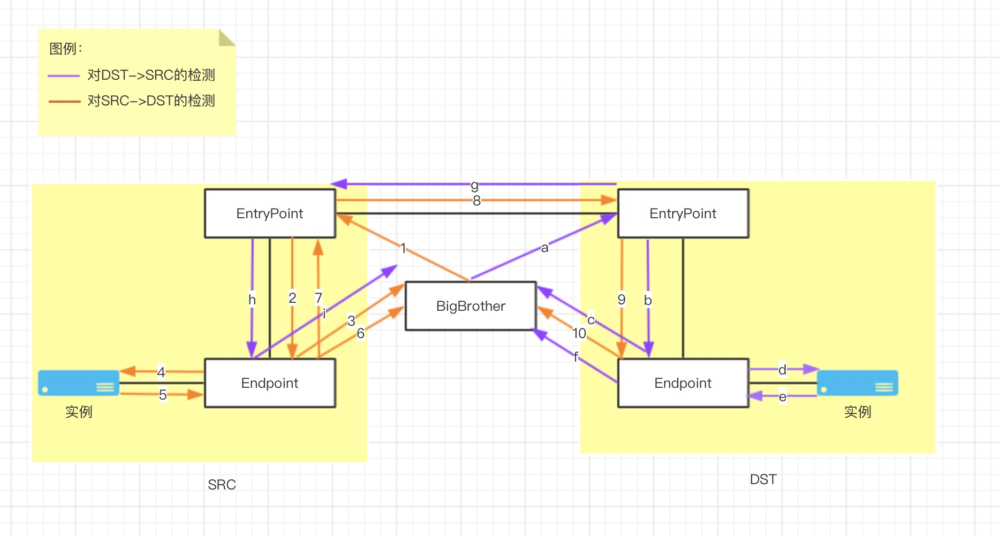
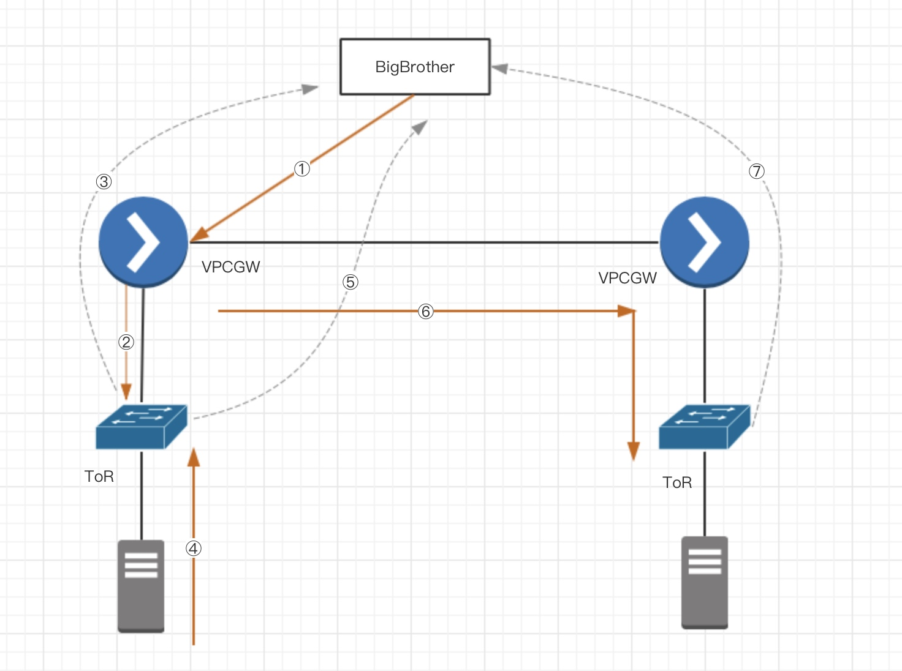
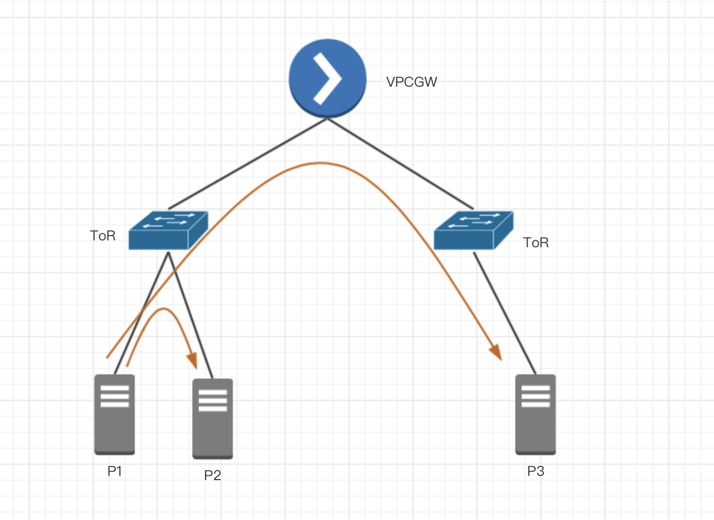
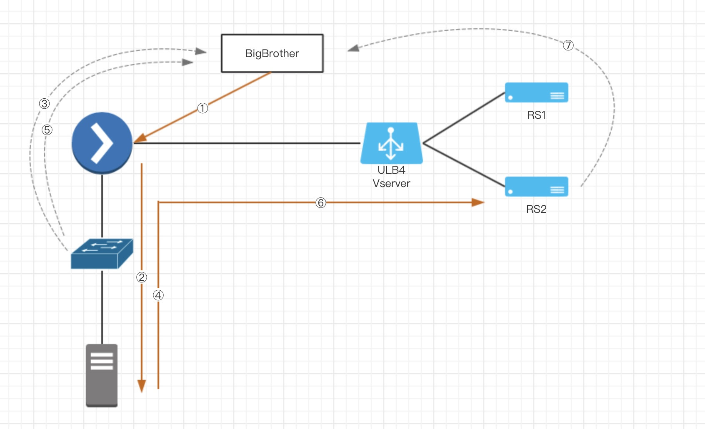
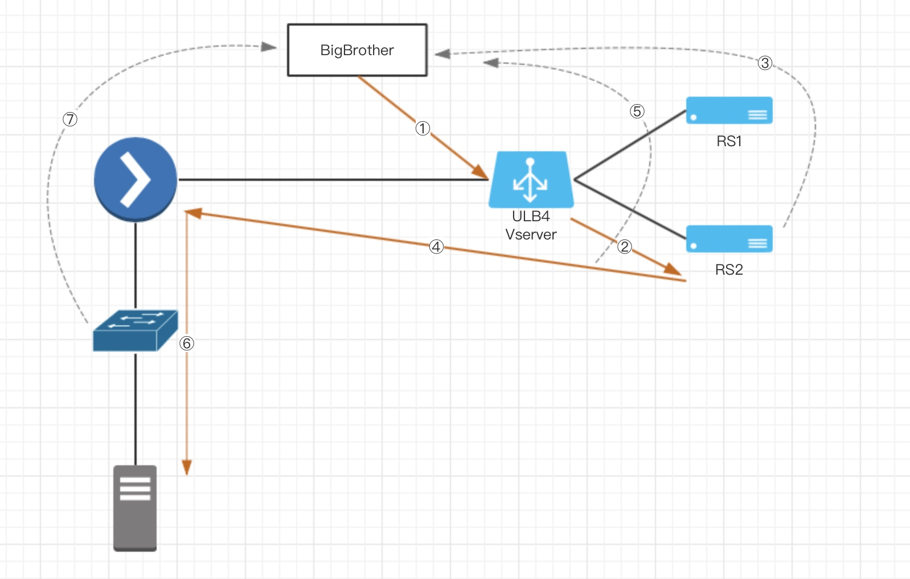
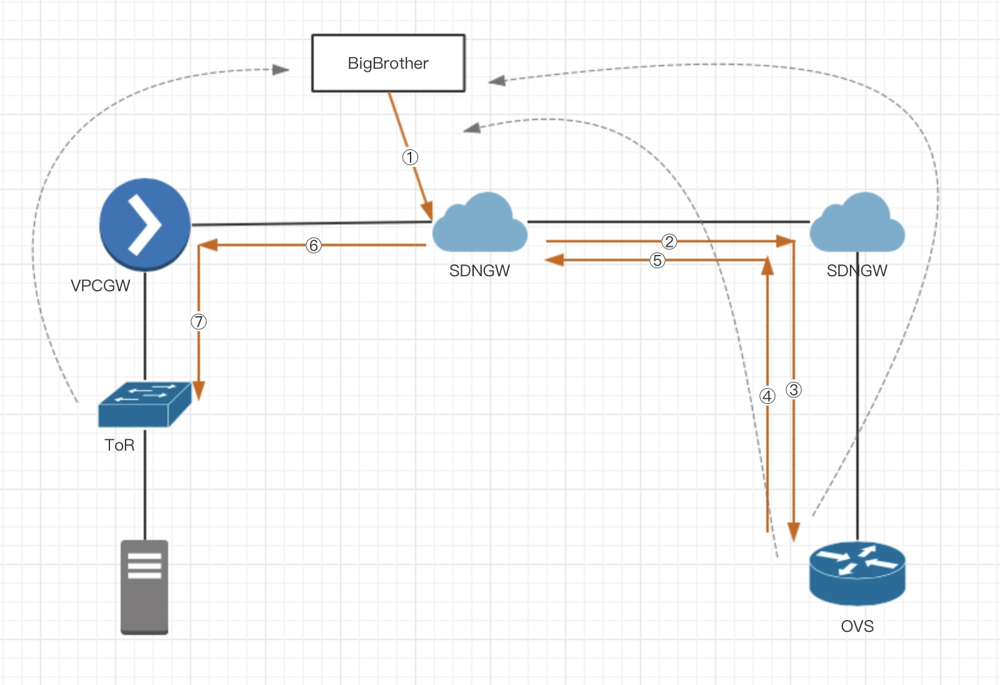
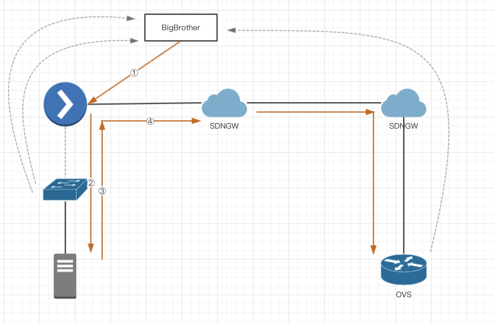

# BigBrother方案设计v4：基于TCP会话的染色和双边探测（最终版）

<p align="right"><font color=Grey>try.chen 2018-11-07</font></p>


BigBrother需要支持以下场景：

- 公有云
- 物理云（智能网卡）
- 托管云（UXR）
- ULB4
- 跨域（UXR）
- CNAT（UXR）
- 公共服务（UXR）

## 概念

定义如下概念：

每个实例通过接入点接入虚拟网络，接入点由两部分组成：

- **EntryPoint:** inbound/outbound报文经由EntryPoint接受、发送。在BigBrother系统中，`EntryPoint`即为注包点，BigBrother会向EntryPoint发送GRE封住后的探测报文；
- **Endpoint:** 连接实例的端点，Endpoint为最接近实例的网元。在BigBrother系统中，Endpoint为采样点，Endpoint会识别并镜像特殊的探测报文至BigBrother。

以下为各种场景下的说明：

| 场景        | EntryPoint     | Endpoint     |
| --------- | -------------- | ------------ |
| 公有云       | OVS            | OVS          |
| 物理云       | VPCGW、HybridGW | 物理机上联ToR     |
| 托管云       | HCGW、CloudGW   | PE交换机        |
| ULB4      | ULB4           | OVS@RS       |
| 跨域网关      | SDNGW          | OVS          |
| 公共服务      | OVS            | OVS          |
| CNAT      | OVS            | OVS          |
| 托管（UXR）   | UXR            | PE交换机        |
| 物理云（智能网卡） | OVS@SmartNIC   | OVS@SmartNIC |
| 跨域网关（UXR） | UXR            | OVS          |
| 公共服务（UXR） | UXR            | OVS          |
| CNAT(UXR) | UXR            | OVS          |

## 检测方案



检测方案分为两部分组成，在图中的流向分为紫色和桔色。
先看桔色流向部分(SRC->DST)：

1. BigBrother向EntryPoint发送探测报文：`GRE | IP(DST->SRC) | TCP(SYN, 80->80)`;
2. SRC端EntryPoint收到该探测报文后发送给Endpoint；
3. Endpoint将该报文镜像至BigBrother；
4. Endpoint将报文发送给实例；
5. 实例回复报文`GRE | IP(SRC->DST) | TCP(RST, 80->80)`,发给Endpoint；
6. Endpoint收到该回复报文后镜像至BigBrother；
7. Endpoint将回复报文发送至EntryPoint；
8. 本地EntryPoint将回复报文发送至对端EntryPoint；
9. 对端EntryPoint收到回复报文后发送给对端Endpoint；
10. 对端Endpoint将回复报文镜像至BigBrother；

至此，单边的检测结束。在检测过程中，BigBrother发送了一个探测报文，共收到了3个采样报文，通过分析这3个采样点可以确认SRC->DST方向是否正常；

紫色部分和桔色部分原理相同，只是注包点为对端EntryPoint，以检测反向通信是否正常。

全部检测结束后，BigBrother一共可以收到六个探测报文。

### 物理云/托管云

以物理云为例，将上述模型展开后可以得到如下详细过程。



这是单边的检测过程，通过再次向右边的VPCGW注包，即可以完成全部检测。

对于托管云也是类似，只是Endpoint是PE交换机。

但是对于物理云，存在如下的特殊场景：


其中，P1访问P2时，经过ToR直接到达，P1访问P3时也是经过交换机直接到达，都不需要经过VPCGW。因此如何测试P1<->P2,P1<->P3就是个问题。

目前VPCGW那端有保护，如果从公有云方向的口中收到源目都是本地物理机的报文会被直接丢弃。

### ULB4

对于ULB4而言，展开模型后，检测示意图如下（左侧为物理云）：

第一步


第二步


但是对于ULB4的问题在于，探测目的port必须是vserver的port，否则vserver不会转发至RS。

### SDNGW

SDNGW展开模型后如下图所示：

第一步


第二步：


但是对于跨域打通，需要在远程OVS上抓包。因此收包程序是否要判断跨域，并通过api写入对端数据库？

### 探测报文

一种方式是使用tcp，源目port为11作为特殊报文，但此种方式无法适配ULB4。另一种方式是通过特殊的源port作为标记，如源port使用0，目的port可以任意指定，这种方式的好处是可以支持ULB4探测。

对于前者，ovs和ERSPAN的规则如下：

ovs预埋flow

```
table=1,priority=40000,tcp,tcp_src=11,tcp_dst=11 actions=Send_BB(),Resubmit(,0)
```

ERSPAN规则：

```
tcp,tcp_src=11,tcp_dst=11
```

## 总结

> v4版本之所以为最终版本，主要是因为解决了之前几个方案都未回答的问题：
> 
> - 通过伪造数据包源IP来实现双边探测，分段检测6条路径，不需要SSH去执行`PacketOut`操作，仅仅需要生成数据包并发送即可，性能极高，规模极大；
> 
> - 依赖TCP的会话（源目端口11）保证稳定的染色效果，基本和协议栈、socket无关；
> 
> - 公有云侧通过ovs flow支持，异构网络通过交换机ERSPAN支持，实现全场景负载，不再局限于公有云内的连通性探测；
