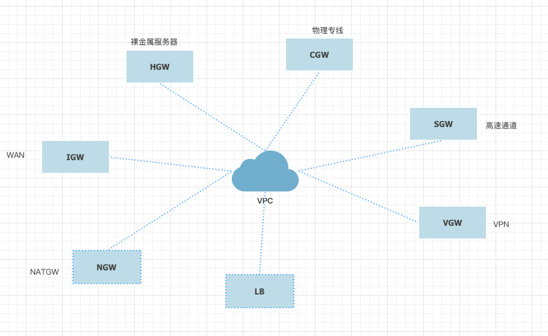
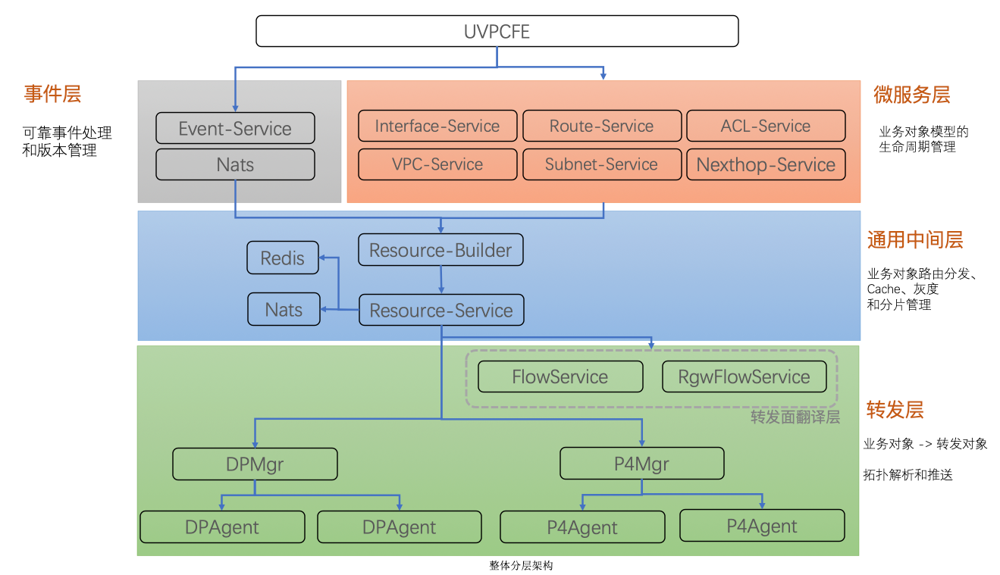
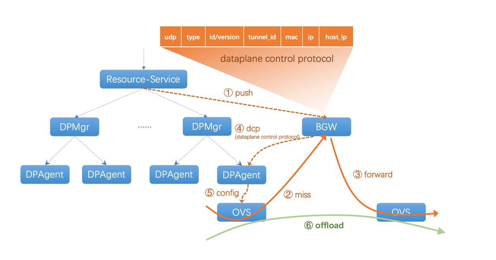

# 虚拟网络架构及VPC介绍

## 架构全景

按照产品和模块的划分，虚拟网络可以主要分为外网层、接入层、异构网络层、UXR和VPC，各层主要介绍如下：

| 模块    | 层次    | 作用                                                                                                                    |
| ----- | ----- | --------------------------------------------------------------------------------------------------------------------- |
| UVER  | 外网层   | 外网网关，接受和处理EIP的外网流量，是虚拟网络南北向流量最外层的入口，承担EIP的BGP宣告、限流、DDoS防御等功能，上联POP点交换机，下联接入层                                          |
| UVER2 | 外网层   | 和UVER功能类似，但UVER2支持IPv6协议，是NAT64、IPv6双栈等产品的外网网关                                                                        |
| IGW   | 接入层   | 负责EIP的NAT地址转换、流量统计和限制，以及外网防火墙功能；技术架构上分为CNAT、CNAT2，前者使用namespace + iptables技术，后者使用CX5网卡和ovs connection track offload技术 |
| NATGW | 接入层   | 负责NATGW产品的地址转换和防火墙，功能和实现类似于IGW                                                                                        |
| ULB4  | 接入层   | 实现内外网的四层接入负载均衡功能                                                                                                      |
| ULB7  | 接入层   | 实现内外网的七层接入负载均衡功能                                                                                                      |
| UXR   | UXR层  | UXR位于网络架构的中心，是解耦异构网络和各种网关的关键组件，通过在网关网元间学习路由，使得UXR成为一个中心化的网关，并实现路由信息的隔离                                                |
| SDNGW | 异构网络层 | SDNGW跨域网关对应的产品为UDPN（高速通道），SDNGW实现了跨地域间的网络转发，不同Region的高速通道互相访问都是由各地域的SDNGW进行转发                                         |
| HCGW  | 异构网络层 | HCGW是混合云网关，负责了混合云和公有云、其他层的流量转发和交互，对应的产品是混合云                                                                           |
| VPCGW | 异构网络层 | VPCGW是物理云网关，负责了物理云主机和公有云、其他层的流量转发和交互，对应的产品是物理云主机，是物理云转发的流量入口                                                          |
| VPNGW | 异构网络层 | VPNGW是IPSec VPN网关，负责了IPSec VPN产品的流量转发，是IPSec VPN产品的流量入口                                                               |
| VPC   | VPC层  | VPC是公有云资源所属的虚拟的、专有的网络空间，是云主机进行网络访问的基础产品                                                                               |
| BGW   | VPC层  | 广播集群承担了VPC内部的广播报文转发的功能，是内网高可用VIP产品的底层关键组件                                                                             |

# 

VPC和异构网络的交互：

## VPC介绍

### VPC发展历史

VPC从最早1.0开始到目前现网全量发布的VPC2.0，以及正在准备灰度上线的VPC3.0，一共经历了三个大版本的迭代。

VPC2.0主要借助于SDN（Software-Defined-Network）理念，通过OpenVSwitch作为虚拟交换机，OpenFlow作为转发协议，配合SDN Controller作为VPC控制器，实现VPC的网络转发和隔离。

### VPC转发面

VPC转发面以ovs(OpenVSwitch)、flow(OpenFlow)为主，同时伴有目前少量、但是未来趋势的、性能更强的CX5网卡（快杰机型）和BlueField智能网卡（25G物理云主机）。通过类比传统网络，可以对ovs和flow有简单理解。

传统网络中的转发通过交换机、路由器来实现，交换机转发以二层信息形成的mac转发表为依据，路由器转发以三层信息形成路由表为依据。

而VPC中的转发则依赖每个宿主机上的虚拟交换机ovs，和其内部的和flow来实现。flow则是VPC转发面进行流量转发的依据。openflow打破了传统网络中二层、三层的分离，一条flow中可以同时包含二层、三层甚至四层的信息：

因此，flow成为了VPC中流量转发的依据和关键，而如何下发和管理flow，如何决定其中的匹配条件，以及将流量正确的转发到目的端则是VPC控制面主要处理的逻辑。

通过宿主机上的ovs的转发和nvgre协议的封装，将虚拟网络承载在物理网络之上，将VM的流量正确转发给目的宿主机端。

而在2019年开始上线的快杰系列云主机中搭配的Mellanox CX5网卡，配合ovs offload，实现了25G 1:1收敛比、高达1000万PPS的性能则代表了未来的转发面趋势：通过ASIC芯片和网卡卸载更多的网络功能，以此取得更强的转发性能。

同时，为了避免物理云主机和普通云主机功能类似，但网络架构不一致（物理云主机需要物理云网关VPCGW）带来的长期演进和运营问题，以及物理云主机更高的网络带宽需求等问题，目前小批量推出了25G物理云主机产品，其采用了Mellanox Bluefield智能网卡（SmartNic），通过将ovs和controller直接跑在网卡的os上，从而打平物理云主机和普通云主机的网络架构差异，去除物理云网关的限制，并带来更高带宽，则代表了转发面发展的另一趋势。

### VPC控制面

VPC2.0控制面架构主要如下，此外还包含端口上报服务、Flow回收服务等。

### 现状和问题

在目前运行的VPC2.0时期，出现了众多痛点问题，而我们的优化受限于架构原因始终是“隔靴搔痒”，无法根治，较有代表性的如下：

- **首包时延**：受限于packet-in的架构，新建通信（新建流）必须要经过控制器处理，控制器处理成功后flow才能下发，后续的报文才能正常转发，因此存在首包时延问题；

- **脏Flow**：由于flow下发后就不再被控制面主动管理，因此在北京二这样亿级别的flow、高负载情况下可能出现请求超时、处理失败等各种异常情况，从而导致flow未能按照预期处理，形成脏flow，影响正常通信；

- **数据库负载高**：由于众多packet-in及扫描和ddos攻击等，新建流通过控制器转嫁压力到数据库，因此数据库负载经常处于高位，经常影响内网新建连通性和API可用性；

> VPC2.0的经验总结请参考：[VPC2.0的痛与美](http://doc.vpc.ucloudadmin.com/#/vpc3/VPC3.0%E7%B3%BB%E5%88%97%EF%BC%88%E4%B8%80%EF%BC%89%EF%BC%9AVPC3.0%E7%9A%84%E5%89%8D%E4%B8%96%E4%BB%8A%E7%94%9F?id=vpc20%e7%9a%84%e7%97%9b%e4%b8%8e%e7%be%8e)

### 未来规划

#### VPC3.0

为了从根本上解决VPC2.0存在的众多问题，VPC3.0选择了Hoverboard模型：VPC3.0主动推送+BGW学习 来解决上述三大痛点问题。

**整体架构：**

**动态学习：**

**用户价值：**

通过重构VPC转发面和控制面，优化后端架构和Flow下发模型，解决此前因为架构瓶颈带来的诸多问题：

- 脏Flow 导致网络不通，影响用户已有业务

- 数据库压力大，导致控制台不可用，增量更新不可用，影响用户新增业务

- 大客户抱怨首包延迟、VIP漂移生效慢，用户体验差

- 无法满足快杰、UK8S等新兴业务对于性能的要求，扩展性受限

**技术价值：**

VPC3.0项目上线后，将会逐渐统一目前的7套控制面，虚拟网络形成 BGW + VPC控制面 + UXR的架构。具备更强的技术竞争力，为后续新产品的开发和上线、性能的提升打下坚实的基础。

#### 云联网
