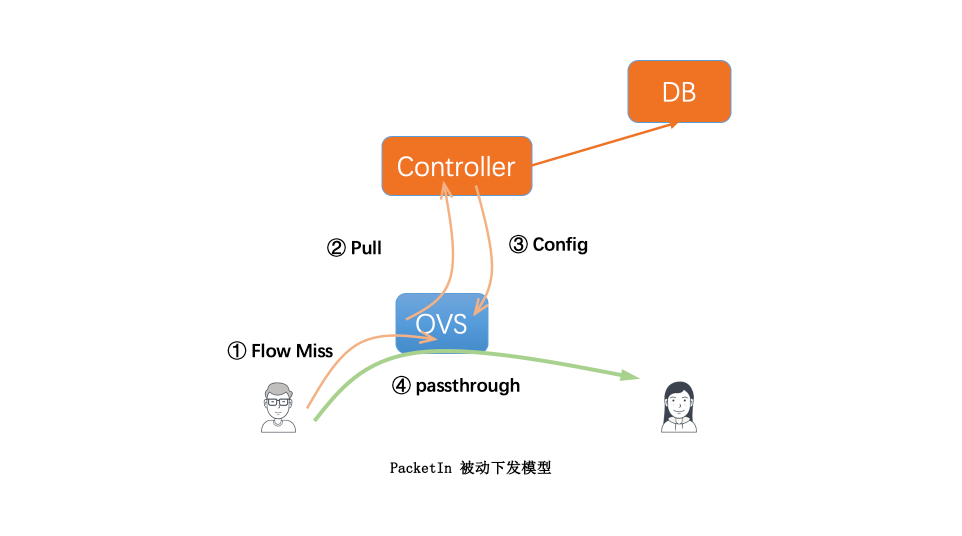
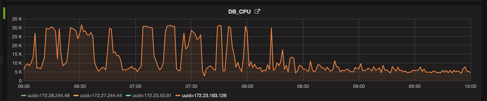
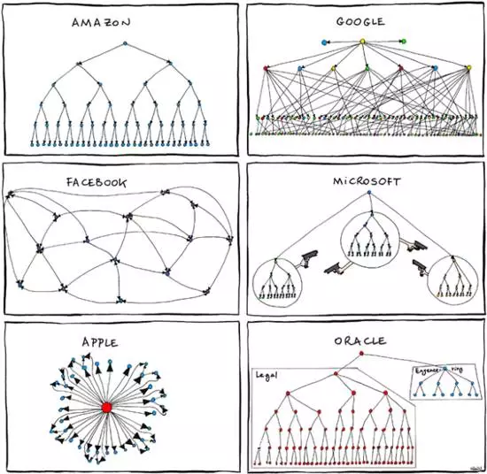
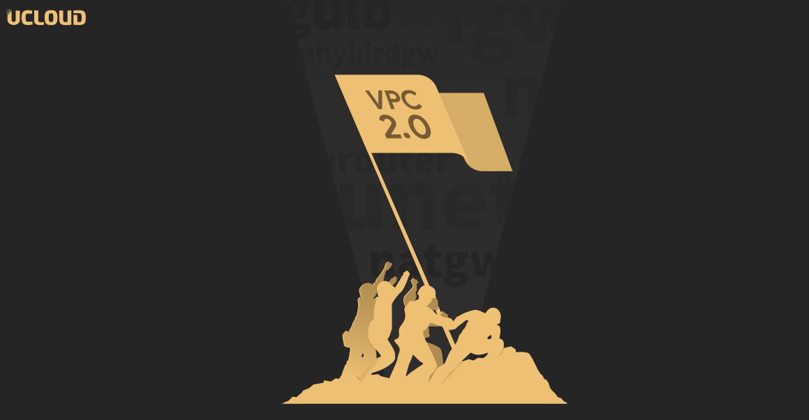

# VPC3.0系列（一）：VPC3.0的前世今生

<p align="right"><font color=Grey>try.chen 2020-10-22</font></p>

## VPC2.0的痛与美

> 每个新产品的上线和维护都蕴含着一代人的记忆，现在人们提到VPC2.0可能会想到那个故障频出的年代背后的跌宕起伏，亦或是29个月全网上线的艰辛或唏嘘。然而在我的印象里，那是春山、灿爷带着我们一帮初出茅庐的应届生们，一起开发、上线、运营着UCloud的新一代底层虚拟网络。从无数个oncall的夜晚，到越来越稳定的VPC，那背后是我们两年的努力和记忆。

   这篇文章我会先略过VPC在UCloud的发展历史，着重介绍一下VPC2.0在持续运营中遇到的几个代表性的问题和痛点，并最终一点点形成VPC3.0的蓝图。

## 一、首包时延：时代的缩影

   `OpenFlow`协议定义了`PacketIn`机制，用于转发面遇到未知报文无法处理时，可以将报文送给`OpenFlow Controller`，由其进行控制面计算后，再下发`Flow`并将报文`PacketOut`给`OpenFlow Switch`。



   这一切看起来很完美，很简单，也很符合直觉。在早期UCloud确实选择了这样一条路，技术实现成本较低，符合业界标准协议，上线之后也运行正常。但在目前这个阶段回头看来，我们却发现业界却不是这么玩的，或者说已经不这么玩了。

   这个模型（Google称为`OnDemand`）的本质在与转发面的流量耦合到控制面，<u>而转发面的量级和转发时延是控制面不能同日而语</u>的，于是我们遇到了如下问题。

### 首包时延高

   控制面`Flow`实时计算涉及多种场景、模块和数据库的访问，时延基本至少在30ms-300ms+，而转发面的同机房时延基本在0.1ms之间，至少相差300倍，30-300ms的延迟这是网络所不能忍受的。不过这种限制仅在于流(源目节点)的首次通信，后续通信由ovs直接转发，将会恢复到正常的内网通信时延，所以这个问题自始至终就有，但曾经不明显，为什么现在越来越严重？

   这主要和容器、Serverless（函数计算）等新兴业务的应用有关，客户随着业务的突增可能会瞬时扩容大量容器并立刻承载业务，因此虽然是首流但因首包时延带来的问题会切实影响客户的业务和体验，这也成为客户业务发展到一定级别后越来越关心的一点。

   并且，诸如函数计算等业务，生命周期可能一共就几百毫秒或是几秒，亦或是响应一次api调用，这时首包的时延就会凸显并放大。

   对于首包时延的优化，我们也曾做了很多努力试图缓解这个问题：

- **Hunter**：监听主机的开机事件，当捕获到开机事件后，会尝试构造和整个VPC通信的ICMP数据包，并通过`PacketOut`发送出去，以此触发首流的下发；

- **控制面优化**：通过各种`sql`和`cache`的优化以及主从分离，加速`PacketIn`处理，降低时延；

### 永无止尽的PacketIn

> **首包时延高**是客户的噩梦，而永无止尽的PacketIn则是我们的噩梦。

在2017~2018年期间，我们曾数次因为PakcetIn突增全部打到控制面，进而带来**数据库负载高**，从而造成连锁反应，导致**控制台API异常**、**新增通信异常**等问题。



而**PacketIn突增**基本分为两类问题：

- 客户的**合法行为**，比如某些server已经释放，而client仍然在进行访问，这种因为server释放后flow已经被回收，进而会导致client访问server的流量会打到ovs controller以及我们的控制面，这种规模大了之后几乎成为一种常态；

- 客户的**非法行为**，恶意的对外**DDoS攻击**以及**内网扫描**，不得不说，我们用我们的controller生生抗住了各种DDoS攻击（观察过Syn Flood，UDP反射，各种伪造源IP、目的IP等）和ARP扫描、TCP扫描，不由得让我想起了我的毕设课题《SDN环境下的DDoS攻击检测和防御》，这可能是个孽缘；

而解决这部分问题，我们也做了很多优化，几乎贯穿整个VPC2.0的运营史：

- **Packet-in limit:** ovs上限制packet-in的速率，但ovs2.3对该功能的支持存在bug，最终未上线；

- **Controller limit:** ovs controller上基于`proto/dl_src/dl_dst/nw_src/nw_dst`等五元组的限速，保证同一条流的packetIn突增速率，且不同流之间不会互相影响（目前的策略是10s允许10个）；

- **控制面限速：** `URouteManager`支持基于`mac/global/proto`的限速，限制单流的PacketIn速率，同时支持基于`信誉`的阈值限速，保证良好客户的使用体验，打击恶意份子；

- **控制面优化：** 主要包含各种Cache的使用、SQL优化、逻辑优化等等；

- **快杰learn-drop Flow:** 快杰运营中，由于大量`PacketIn`冲击controller，导致控制器hang住，于是在`ovs 2.10`版本中使用了bugfix后的ovs `PacketIn`速率限制；并预埋learn-drop flow，限制同一个五元组（同上）30s只允许一次PacketIn；

- **Controller-alive监控：** 通过`PacketOut`构造探针报文触发`PacketIn`，用于拨测Controller和控制面(URouteManager)是否存活，否则告警；

- **Controller-shield：** 扮演Controller watchdog角色的同时，监控controller进程CPU利用率，并通过日志自动封堵某些异常mac的`PacketIn`动作（通过下发flow）；

- **基于ES的攻击检测：** 通过`ElasticSearch`和`Grubbs`离群检测算法，主动识别异常流量，正确率约为**85%**，但由于当时公司没有统一维护的ES，且我们自己维护的ES无法承载控制面日志规模，最终方案未用于线上；

- **外网Drop Flow：** 曾经VPC寻址时，如果地址空间内未发现目的IP，则会按照默认路由送给CNAT，而其中往往很多都是内网地址空间，对于这种内网扫描，最终通过低优先级的外网Drop Flow默认丢弃；

- **Controller连接池改造：** controller由短连接改造为长连接，减轻Controller、URouteManager（UNet-Proxy）由于频繁`PacketIn`带来的频繁TCP连接建立、释放的压力；

- **EIP绑定延迟生效：** 线上观察到很多未绑定EIP、不允许出外网的VM始终发出外网流量，而又因为我们的出外网路由位于`Global`级别的默认路由表中，导致这部分流量始终请求控制面。对于这种未绑定EIP而持续`PacketIn`的流量，我们会下发`hard_timeout`为**30s**的drop flow丢弃这部分流量，同时，EIP绑定也会延迟生效；

- **关机Drop Flow：** 如果VM关机，则该VM相关的flow都会被清理，然而如果该VM仍绑有EIP，则外网流量会经UVER流经IGW，并由于关机flow无法下发造成持续PacketIn，因此对于关机VM的PacketIn会下发hard drop flow，并自动超时；

*站在用户的角度来说，我们很难说用户发出的流量何为合法或者非法，但由于我们的架构限制、技术限制，注定我们的控制面要承受这部分不能承受之重。*

首包带来的问题也是从架构伊始就确定了，那些我们曾经认为的简洁、轻量终究随着业务规模的发展，通过另一种方式回报给我们。`Andromeda`从一开始就选择了`Preprogrammed`模型，站在今天来看无疑是明智的，而我们也许是在`On Demand`道路上走的最远的云计算公司。

每个阶段技术的表现背后都有基于时代和内外环境的选择，这无非好坏和先进，只有适合，和这背后的历史。就像当年业界还没有`Overlay`封装协议的标准时，2014年的我们选择了`NVGRE`，而阿里云选择了`三层VxLAN`，而最终业界形成了`二层VxLAN`的标准，这有时代的局限性，当然也有一部分运气。

技术的发展也不是一蹴而就，我们终究需要不断前进，螺旋上升，不管是我们还是`Google Cloud`的`Preprogrammed`，亦或是`阿里云`、`腾讯云`，大家最终都来到了`Hoverboard`模型的面前，似乎都已心照不宣。

当然`PacketIn`模型也有自己固有的优势，由于只有新建流会上送到控制面，计算后随即offload到`OpenVSwitch`上，从此"失联"，因此任何控制面故障、甚至是全局规模性规模都不会造成转发面的规模性故障，这样帮助我们几乎平稳度过了VPC2.0的发展历史——即使小毛病不断，但VPC转发面几乎没有任何规模性故障或是重大故障。

首包问题是VPC2.0的一个缩影，也是最具代表性的直观表现，而这也恰恰体现了VPC2.0的痛与美。

---

## 二、脏Flow：永远的痛

   在前文中我们提到，正是因为 `PacketIn` 的Flow一经下发之后，除非后续进行`迁移`或是`释放`时的回收，否则对于我们的控制面来说是 **失联** 的，而这正是帮助我们通过**无状态**、**分布式** 避免规模性、全局性问题的功臣，但同时这些**遗失**的Flow，往往也因各种原因、各种BUG成为影响VPC2.0可用性的最大罪臣。

   对于VPC来说，以下几种问题往往非常影响客户体验：

- **新建云实例/SecondaryIp/VIP不通**

- **漂移、迁移后不通：** 

对于这些问题，客户几乎只能通过提SPT工单，由我们介入后定位原因、修复问题而恢复。而这些各种各样不通背后的本质原因，都是由于虚拟网络转发层的Flow因为各种各样原因没有清理干净而导致的。

对于造成`脏Flow`问题的原因，通常有以下几种：

- **API超时：** 如`FlowGCManager`删Flow超时，或者`URouteTableManager`推路由Flow超时，或者`SDNAgent` **Add|Del** `OpenVSwitch` 超时，或者`UVPCFE`调用后端超时，或者访问`Redis`超时等等。这是由于在以往上线时，系统仍然非常的粗糙，几乎完全未考虑各种异常情况，并未做任何应对和自愈亦或是人工接入，导致*超时了就超时了，失败了就失败了，最终这些都有一定的几率沉淀为脏Flow*。

- **非预期性异常：** 简而言之就是BUG，由于未有良好的测试、监控、拨测等手段，往往也会产生各种BUG，进而带来各种各样的问题；

- **服务异常或流程异常：** 诸如宿主机宕机后回滚的Flow异常（程序BUG未覆盖这种场景）基于wiwo的主动状态机因为系统时间回滚带来的`Port上报`异常、云实例迁移后由于两端仍在上报端口带来的抢占异常；

在2017年脏Flow问题尤为严重，也是在当年也是由灿爷出马，开发了一套`Flow对账系统`，在那年我们清理了历史上规模最大的脏Flow，数量达到千万级，而这背后都是沉沉的历史债。

也是在2017年，由于我们根据`Flow对账系统`判定某条Flow为脏Flow后进行自动清理，而这被我们判定为不合法的Flow实际上为一条**非标Flow**，从而导致一起用户case，最终迫于现网的质量压力，`Flow对账`举步维艰。

对于**脏Flow**问题，我们也有过多次优化，包括：

- **Flow对账系统：** 正如前文所说，`Flow对账系统`其实是一套单独的控制面，他的更新需要随着业务的更新被一同更新，而这导致的问题就是非常难以维护；同时由于无法准确识别什么是 **脏Flow** 以及什么是 **非标Flow**，从而`Flow对账系统`也无法承担历史赋予的使命，并在历史前进的浪潮中被放弃。在2017年那个VPC2.0一切刚刚开始的年代，我们没有对Flow **精细化运营**的能力，没有活跃Flow分析系统`River`，也没有连通性检测系统`BigBrother`。而正如最近在做的迁移优化，一切那么水到渠成，但底层实际是各种支撑系统的自然生长，为上层业务的优化铺平了道路。就像早在在2008年`Google`就提出的`GAE(Google Application Engine)`由于理念太过超前终究未被市场认可， 云计算的果实最终被`AWS`从`IaaS`开始一步一个脚印收入囊中，要知道即使是`Docker`也是在`GAE`推出的5年之后才被提出的；

- **Redis对账：** 历史上我们曾经遇到过多次`Redis` **缓存不一致** 的问题，从而造成转发面路由Flow不正确的问题，虽然我们使用的是`Cache-Aside pattern`，但仍然有各种各样的原因造成`Redis`并未成功更新，并造成持续性的**脏读**。自从我们上线了`Redis对账`系统之后，这个问题也终于成为了历史问题；

- **持久化重试机制：** 对于关键API我们加了持久化重试机制，如`FlowGCManager`的`delete_flow_request`，`URouteTableManager`的`push_route_forward`接口和`delete_cache_request`接口，对于这些低频、重要写请求会被持久化在数据库中，并在失败后持续性重试直到成功；

`脏Flow`问题的解决背后也涉及到`VPC3.0`的核心问题，即**转发面对象**（Flow对象）和**业务对象**的映射，而这也离不开我们在2018年所做的一项关键变革和理念的提出：**数据Flow**和**逻辑Flow**拆分。

在以往`VPC2.0`的Flow中，Flow是**有状态**的，是涉及到某个具体业务和场景的，是高度定制化的，如：

```bash
priority=1000, in_port=12, dl_src=11:11:11:22:22:22, dl_dst=33:33:33:44:44:44, 
ip, nw_src=1.1.1.1, nw_dst=2.2.2.2 actions=send_to_some_host
```

   当我们创建了`2.2.2.2`这台云实例后，如果它需要和`1.1.1.1`访问，那必须要下发这样一条Flow，并且是和协议相关的，如果是两者之间的`ARP`访问那Flow又不一样，如果是后来又创建了一个云实例`3.3.3.3`，那仍然需要再下发一次类似的Flow。

   可以看到这样的Flow是**冗余的**、**命令式的**、**业务相关的**、**具象的**。

   而`VPC3.0`所做的最大改变，是把这样的Flow变成了 **声明式的**、**抽象的**、**业务无关的**。具体来说，当创建一个云实例后（如A），则会生成如下类似的Flow(*仅为实例，实际有区别*)：

```bash
reg0=A_mac actions=load:1->reg0, load:A_ip->reg1
reg0=A_mac actions=load:1->reg0, load:A_subnet_id->reg1
reg0=A_ip actions=load:1->reg0, load:A_mac->reg1
reg0=A_mac actions=load:1->reg0, load:A_host->reg1
```

   可以看到Flow变成了一个函数查找的逻辑，入参即为`match`，返回值即为`action`，我们根据一些寄存器，查询数据表(table)并保存另一些寄存器，而这些寄存器正是云实例（A）自己的关键属性（如 `mac`, `ip`, `vni`, `subnet_id`, `host`等）。至于这个对象被谁访问、被那种协议和场景用到，和Flow完全无关。<u>一个业务对象可以被**可逆的**、**唯一的**映射到一个转发对象（Flow对象）</u>。

   这种函数查找、携带对象本身数据的Flow我们称为`数据Flow`，而剩下的和业务场景相关、协议相关、但唯独和数据无关（对象无关）的Flow我们称为`逻辑Flow`。可以在这里看到，我们再一次回到了`SDN`的核心理念 **转发和控制分离**，而这也是我们后续Flow模型改造的基础。

   这个思路的巧妙性不言而喻，并且我们基本已经在受限的情况下将Flow玩到了极致。我们通过简单的Flow和`resubmit`已经实现了逻辑控制中的`if-else`以及`for-range`，并在Flow层面实现了诸如`项目打通`等非常复杂的业务逻辑，有时候我们甚至开玩笑说已经可以拿flow来写代码了，当然这会比汇编更复杂更难维护。

   其实这背后也有我们难以明说的痛，正如那句话所说 *简洁的背后皆是复杂*，`VPC3.0`的flow变得异常复杂，而这也凸显了VPC对`OpenFlow`的深度依赖，和对`OpenVSwitch`的控制力和定制能力的不足。

## 三、性能问题

   正如前文所述，`PacketIn`模型对控制面的压力非常的敏感，而大规模`PacketIn`上送控制面将会凸显控制面的压力，从而导致Flow下发耗时变高，最终再反馈到大量的`PacketIn`上，形成恶性循环，造成雪崩。

   同时由于我们无法良好的隔绝转发面的各种未知流量，这部分始终极大的挑战控制面负载。所以`VPC2.0`对单个地域的规模限制往往受限于控制链路中最后的一环：数据库以及它的从库们，而这也恰恰是我们做的不够好的体现。

---

## 四、 康威定律：分裂的控制面

   VPC2.0一共有6套独立的控制面，大家各自为政，却又做着差不多的事情，这可能是康威定律的又一次胜利。



   在VPC2.0的开发周期内出现了多个产品需要和VPC交互，而我们内部也是按照产品来组织相应的人员开发，因此，这导致明明都是做着访问VPC的事情，实现着差不多的逻辑，却因产品而异开发人员而异，分裂出不同的控制面，如

- 物理云VPCGW(HybridGW)

- 托管云HCGW(CloudGateway)

- 广播集群

- UXR

- VPC控制面

- Flow对账系统（目前已不再维护）

松散的控制面最终这也导致为了支持一种新特性或者场景，整套控制面需要一起或多或少的改造，再相应发布和灰度，导致产品的开发上线周期慢，风险高，现网版本或机制不统一。

举几个最近的例子就有：

- **全网支持t_route_nexthop：** 直至今日物理云网关的版本仍然在发布队列中；

- **支持CNAT2：**，VPC支持后，物理云网关、托管云网关、UXR都需要分别支持和上线；

- **事件表机制：**，托管云独立集群已经上线，物理云网关仍在发布队列，广播集群仍未改造；

UXR的立项之初，也是为了解决异构网络之间互相侵入、耦合的问题，现在UXR离实现这一目标已经越来越近，而我们也在收获这项能力带来的果实，例如IGW容灾已经不需要VPC关系，VM迁移HCGW也不再需要关心。

通过UXR，异构网络自己已经不需要关心通信对方的控制面细节，而只需要关心自己的内部细节，极大简化了控制面逻辑，也为将来的控制面统一铺平了道路。而接下来，VPC3.0也将继续举起大旗，继续统一VPC控制面，将整个VPC作为一个Service提供完全统一的VPC实现和入口。

## 五、后记

   VPC2.0从2016年上半年开始立项开发，到2018年下半年全网升级完成，历经29个月。在当年11月我们在酒店举行了一个盛大的项目庆功会。



   这29个月一路坎坷走来，做事情的人在变，做事情的部门在变，被骂过，被质疑过，但唯一不变的是，我们曾经为了同一个目标而奋斗，为了一起做一件事而风雨兼程，尽管这些人如今可能散落在公司的各个部门，亦或是行业的各个角落，但相信大家仍然在做同一件事：

> 代码成就万事基积沙镇海，梦想永在凌云意意气风发。

   VPC2.0如此，VPC3.0亦是如此。
