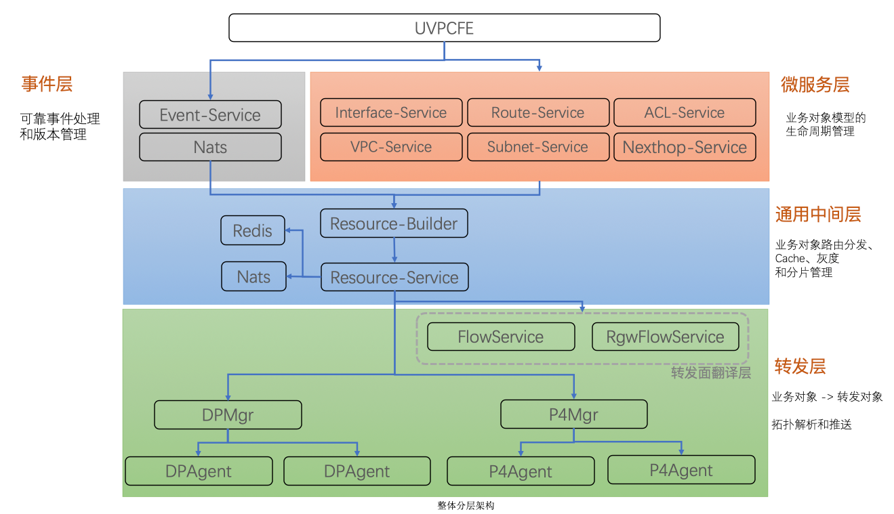
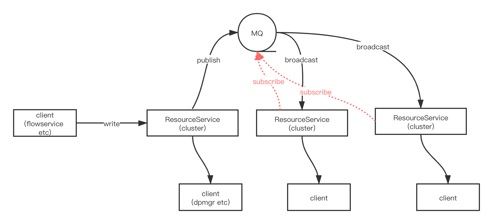

# VPC3.0系列（二）：模块和分层

<p align="right"><font color=Grey>try.chen 2020-06-19</font></p>

## 整体设计

开局一张图：



VPC3的控制面涉及众多服务，按照对象模型和业务流程可以分为四层：事件层、微服务层、中间层、转发层，以下分别介绍。

### 微服务层

微服务层由众多微服务构成，如`Interface-Service`、`Subnet-Service`、`VPC-Service`等，这些服务由差不多的框架构成，实现差不多的逻辑，并且只访问数据库，主要负责业务对象的生命周期管理，如创建、更新、销毁等。

一个典型的Service提供如下API定义：

```protobuf
service VPCService {
    rpc Create(CreateVPCRequest) returns (CreateVPCResponse);
    rpc Update(UpdateVPCRequest) returns (UpdateVPCResponse);
    rpc Delete(DeleteVPCRequest) returns (DeleteVPCResponse);
    rpc Describe(DescribeVPCRequest) returns (DescribeVPCResponse);
}
```

如`VPCService`负责提供增删改查接口，以满足对`VPC`这个资源（产品）的操作。

对于业务微服务来说，简单是核心要求，因此这些服务只提供统一的`gRPC`接口，并且不依赖任何外部接口，接口具有幂等、原子等特性。

每个微服务Service的API都是声明式的，返回的对象也是一个完整的业务对象。

### UVPCFE

`UVPCFE`目前为独立一层，关于UVPCFE的介绍可以参考[这里](https://ushare.ucloudadmin.com/pages/viewpage.action?pageId=7766269)。`UVPCFE`提供了私有网络相关的`UCloud Open Api`，作为控制台Console(*ucloud.cn*)和API入口，用于进行虚拟网络相关产品的管理，官网的API介绍可以参考[UCloud文档中心](https://docs.ucloud.cn/api/vpc2.0-api/README)。

`UVPCFE`未来将只会负责以下几部分内容：

- 对外提供基于HTTP的`Open Api`,对内调用微服务层的`gRPC Api`，自身不再访问数据库，对象的管理（如创建VPC）将交给`VPC-Service`，同时也不再负责事件的创建等;

- 除和内部服务交互外，还负责和资源系统交互来管理资源、计费系统管理订单，以及其他外部API（如网络产品部相关API）等；

- 作为对象API（微服务层）上的抽象层，可根据业务提供对象API的组织、定制等，如支持`graphQL`等模式；

当微服务层足够**简单**、足够**独立**和**内聚**后，可以分解API层的复杂度，由`UVPCFE`专门负责API层的对外业务逻辑，如UVPCFE提供的`DeleteNetworkInterface`这样一个业务API，将会拆分为以下模块和交互：

- 访问`UAccount`提供的`DeleteResource`接口；

- 访问`UNETFE`提供的`UnbindEip`和`ReleaseEip`接口；

- 访问`Interface-Service`提供的`DeleteInterface`接口；

并且由UVPCFE负责考虑`DeleteNetworkInterface`类似接口的限流、熔断、校验、配额，以及多模块交互式时的原子、幂等等特性。

目前阶段，仍然由`UVPCFE`直接操作数据库管理对象，并发送事件，微服务层目前仅被转发层使用。

### 事件层

事件层由服务`Event-Service`、`nats`和`redis`组成，负责生成事件、对象版本管理、发送事件等。当`UVPCFE`对业务对象（如VPC）进行新增、更新、删除等操作时，会调用`Event-Service`的`Pub|Bpub`接口发送事件，`Event-Service`实现的Service定义如下：

```protobuf
service EventPubService {
    // 异步接口, 不支持response中返回版本号，增强可靠性
    rpc Pub (PubEventRequest) returns (PubEventResponse);

    // 同步接口，支持response中返回版本号
    rpc BPub (BPubEventRequest) returns (BPubEventResponse);
}

service EventSubService {
    rpc Sub (SubEventRequest) returns (stream SubEventResponse);
}

service EventObjectService {
    rpc DescribeObjectVersion(DescribeObjectVersionRequest) returns (DescribeObjectVersionResponse);
}
```

对于VPC3.0来说，事件是一切变更的基础，后续所有的对象生成、对象推送都是依靠消费事件来实现增量更新，因此事件的可靠也是重中之重，对于如何保证事件的可靠，后面我们会单独再讲。

简而言之，`Event-Service`会实现如下逻辑：

- 将事件持久化入数据库，产生事件版本号，并更新对象版本号；

- 将事件发布到MQ中；

- 通过`redis`和内存队列提高可靠性；

- 提供`event`的拦截器功能，用于基于业务扩展和衍生事件；

而`Event-Service`发布给`nats`的事件会被下游的服务如`Resource-Builder`订阅到。

### 中间层

中间层主要有服务`Resource-Builder`和`Resource-Service`组成，该层主要以`Resource-Service`作为核心，提供了业务对象的路由分发、缓存、对账、分片和灰度等能力。

#### Resource-Builder

其中 **Resource-Builder** 主要负责订阅事件MQ，收取对象变化事件，并根据事件类型和事对象id，分别请求微服务层的众多微服务，以此构建出一个完整的业务对象（如订阅到VPC事件，访问`vpc-service`的Describe接口，构建出一个VPC对象），并且序列为一个通用资源(Resource)后，写入`Resource-Service`。通用资源的定义如下:

```protobuf
message ResourceMetadata {
    string type      = 1;
    string uuid      = 2;
    uint64 id        = 3;
    Version version  = 4;
    bool   deleted   = 5;
    uint32 account   = 6;

    // 对象最新变更的事件ID
    string eventId   = 10;

    // 用于追踪对象的span上下文
    map<string,string> spanContext = 11;
}

message Resource {
    ResourceMetadata    meta      = 1;
    google.protobuf.Any body      = 2;
}
```

之所以需要定义`Resource`是因为`Resource-Service`会管理众多对象，如`Interface`、`VPC`、`BridgeObject`等，因此需要通用的摘要信息，也即定义中的`ResourceMetadata`。

#### Resource-Service

`Resource-Service`是一个资源管理的中间层，由两个组件：`redis`和`nats`构成，其核心定义如下：

```protobuf
service ResourceCacheService {
    rpc Read  (ReadResourceRequest)  returns (ReadResourceResponse);
    rpc Write (WriteResourceRequest) returns (WriteResourceResponse);
}

service ResourceWatchService {
    rpc Watch (stream WatchResourceRequest) returns (stream WatchResourceResponse);
}
```

- `ResourceCacheService`提供了资源的缓存读写，主要给`Resource-Builder`、微服务层服务使用；

- `ResourceWatchService`提供了资源的`watch`机制，用于client通过`gRPC Stream`订阅关心的指定对象的全增量信息，其典型client有`dpmgr`和`flowservice`。其中`dpmgr`关心的对象有`BridgeObject`，而`flowservice`关心的对象如`Interface`、`Subnet`、`VPC`等等；



对于`Resource-Service`其提供的功能主要有：

- 提供了**对象在服务间路由**的能力：`Resource-Service`的典型client如`dpmgr`和`flowservice`，两者关心的对象是不同的，而`Resource-Service`会负责对象在client间的路由和分发，如将`BridgeObject`路由给`dpmgr`，而`VPC`路由给`flowservice`；

- **资源缓存能力**：提供了强一致的资源缓存能力，并具备统一的对账机制，微服务层的Service或者转发面Service无需维护各自的缓存，而由`Resource-Service`集中处理；

- **分片和灰度能力：** `Resource-Service`提供了分片和负载均衡能力，提供了集群间负载均衡，集群间分片&灰度的能力，提供了水平扩容能力。并且得益于基于`Account&Mask`的`LPM`匹配，其维护分片策略非常简单，并且灰度切换是原子操作，分片迁移时不会丢失变更；

一个典型工作流程是，`ResourceCacheService`的`Write`接口收到变更，将该对象存储后，按照client在`ResourceWatchService`中注册的订阅信息，将对象通过`gRPC Stream`发送给关心的client。

### 转发层

转发层可以细分为 **转发面翻译层** 和 **DataPath层**，前者主要有`FlowService`、`BgwManager`等组成，后者主要有`dpmgr`、`dpagent`、`dpecho`组成。

#### 转发面翻译层

转发面翻译层负责了业务对象到转发面对象的具体翻译和转换，如`FlowService`会将一个`Interface`对象翻译成`OpenVSwitch`所使用的`BridgeObject`对象，而`BridgeObject`是含有`OpenFlow`的转发面对象，会通过`DPAgent`下发给`OpenVSwitch`。

转发面翻译层是一个业务逻辑层，负责了业务对象和转发面对象的映射，这部分对于整个系统来说是**松耦合**的、**可插拔**的、**模块化**的，方便后续集成新业务，对于目前来说除了VPC在使用，云联网的`RgwFlowService`也会将业务对象映射为自己关心的、独特的`BridgeObject`对象。

当未来要支持新的转发面网元时，只需要将`FlowService`替换成新的`XXService`即可，实现业务对象到`P4`、`DPDK`或是其他网元表项的映射。

对于`FlowService`来说，从`Resource-Service`关心的业务对象（如`Interface`)后，会加工、映射成对应的转发面对象`BridgeObject`，并通过`Resource-Service`的`Write`接口再写会`Resource-Service`，并被进一步路由给`dpmgr`。

#### DataPath层

DataPath层主要由两个服务组成，分别是`dpmgr`和`dpagent`。

简单来说，`dpmgr`提供了一个推送管道，主要负责虚拟网络的**拓扑解析**和转发面**对象推送**。而`dpagent`自上线后，也会`watch`在`dpmgr`上，从`dpmgr`接受源源不断的 **相关性** 对象，并通过`OpenFlow`或者ovs命令行，进行flow对象的更新。

DataPath层随转发面网元类型不同有相应的`manager`和`agent`，如对应`P4`的`p4mgr`和`p4agent`，这部分也是松耦合、可插拔的。对于目前实际业务来说是`bgwmgr`和`bgwagent`，用于下发业务对象到广播集群所使用的`P4 Switch`中。

## 典型工作流程

- `UVPCFE`收到API请求,调用微服务层服务`VPC-Service`完成对象的创建，并调用`Event-Service`发送事件;

- `Event-Service`持久化事件、更新数据库对象版本后，并广播事件；

- `Resource-Build`收到该事件后，构建出一个完整的`VPC`对象，并序列化为`Resource`，调用`Resource-Service`的`Write`接口，发送完整对象；

- `Resource-Service`收到该`VPC`对象后，发送给关心的client，`FlowService`和`RgwFlowService`；

- 这两个service收到`VPC`对象后，加工成不同的`BridgeObject`，并再此写入`Resource-Service`；

- `Resource-Service`会将该`BridgeObject`对象发送给关心的client: `dpmgr`；

- `dpmgr`通过拓扑解析、相关性解析后，选择关心的`dpagent`列表并发送对象；

- 若干`dpagent`收到对象后，更新内存缓存，并通过`OpenFlow`或者`ovs`命令行，更新ovs flow，完整转发面更新。
