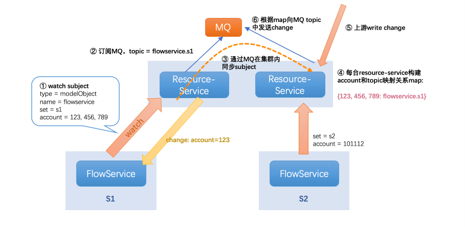
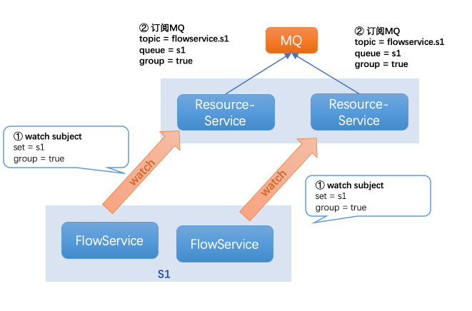
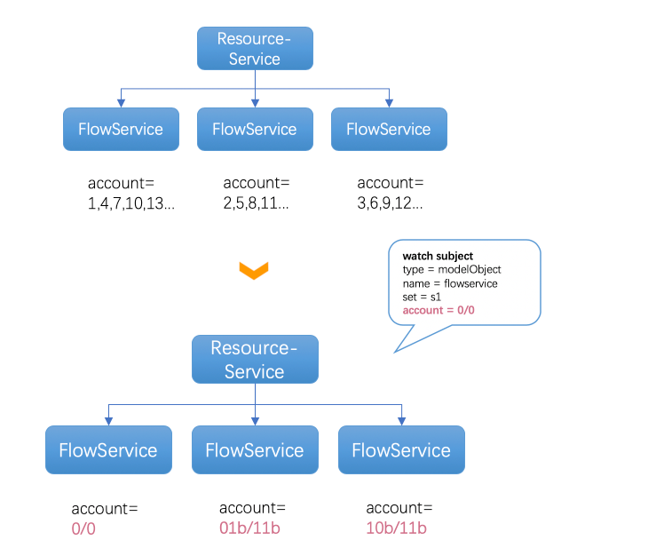

# VPC3.0系列（五）：分片和灰度

<p align="right"><font color=Grey>try.chen 2020-06-18</font></p>

在前文中提到，我们的业务模型是FlowService(DPMgr)通过gRPC Stream watch在Resource-Service上，那么如何让Resource-Service按照指定account来将publish给FlowService的事件进行分片呢？


## 集群间分片&灰度

对于这个问题，我们考虑新建两个集群的FlowService(或DPMgr)，分别用于处理不同用户的事件，通过分片的方式来解决事件频率的性能问题。



详细流程如下：

1. 新建FlowService s1集群，期望用于处理account = 123, 456, 789用户的事件；s2集群，期望处理101112用户的事件；

2. FlowService s1集群节点向Resource-Service Watch时携带如下关键信息（watch subject)：
   
   - type: 订阅的对象类型，如model.Interface或datapath.BridgeObject；
   
   - name：服务标识，如flowservice；
   
   - set：集群信息，如s1；
   
   - account：用户信息，如123, 456, 789

3. Resource-Service收到该watch subject时，会向MQ（nats）订阅，并且topic由name和subset组成，如flowservice.s1；

4. 同时，通过MQ在集群内的Resource-Service节点广播这个subject信息，集群中的每个RS节点收到该subject信息后，各自构建出account和topic的映射关系index：类似如
   
   ```go
   var index map[string]string = {"123": "flowservice.s1"}
   ```

5. 后续上游（如Resource-Builder)写入变更时,RS节点会根据上述index，通过type+account遍历出所有关心的topic，并且把事件发送给相应的topic；

6. 对应的RS节点从topic收到事件之后，再通过gRPC Stream信道发送给对应的FlowService(s1)

通过上述流程，以支持集群间的分片和灰度功能，通过多个集群来解决水平扩容问题，进而解决事件变更频率过高的问题。

### 衍生问题

对于上述方案，有诸多不得不解决的衍生问题，如：

- **如果集群内单点：** 集群单点服务宕机，不论是等待K8S再拉起POD，还是account快速容灾，都必然会影响一段时间的事件处理，进而影响业务；

- **如果集群内多副本：** 集群内的多个副本由于都会watch一样的subject，会导致每个人都消费了同样的事件，从而导致冗余消费、处理和广播，非常低效，相当于成本上升；

- **分片列表如何维护：** 新增、删除account需要从账户系统订阅同步、迁移account时非原子操作等问题如何处理

因此，我们还需要设计一套集群内的负载均衡方案。

### 潜在隐患

1. 如果RS和MQ之间的消息丢失，则目前系统内无主动弥补的手段，可考虑迁移到nats-streaming server以使用其支持的断点续传功能；

2. 但仅仅靠MQ的断点续传功能是不够的，因为watcher可能离线，因此续传的消息被RS消费，但并没有实际发给watcher，因此更佳的方式是RS也做到断点续传，防止因为网络抖动、hang等问题带来的事件丢失；

## 集群内负载均衡

对于集群内负载均衡的支持，我们借助了nats的queue模式，通过group参数来设置集群内的负载均衡，具体流程如下：



可以看到与之前不同的是，watcher订阅时的subject除了有之前的信息，还新增了group参数，通过true和false来标识是否开启集群内负载均衡模式。

具体原理是同一个集群内的多个节点，都会watch在同一topic `flowservice.s1`上，同时会设置queue 为`s1`，并且group 为`true`，于是在RS订阅MQ之后，MQ会在同一个group直接负载均衡投递，因此带来的效果就是集群内watcher的负载均衡。

通过集群内负载均衡的方式，我们可以支持集群内的高可用，在宕机一个POD之后，仍然有其他POD提供服务。并且通过该方案也可以降低分片组，简化运维和维护。

## 基于Account/Mask的LPM灰度匹配

前文中我们提到，基于具体account的分片列表（如s1: 123, 456, 789; s2: 112233)来分片管理起来有诸多不便，主要问题如：

1. 分片列表难以维护：全量有效account信息有数万个，而该数万account都需要分组并进行维护，付出的管理和运维成本较高，容易出错；

2. 新增、删除account需要同步：这些信息必须由我们想账户系统订阅，并动态更新分片列表，否则会造成分片规则丢失，事件处理失败等问题。因此引入了很多复杂度，需要考虑同步时延、可靠性等问题；

3. 迁移account时不是原子操作：如果需要容灾或者灰度account，那么需要将某个account从s1迁移到s2，正常的操作我们需要现在s2添加该account，之后再从s1删除该account；但是其中会出现两个集群都有同一个account的情况，而此时RS发给谁则是未定义的；

4. 扩容烦杂：集群扩容时，需要迁移部分account到新的分片上；

为了解决如上问题，我们借鉴了IP转发中的LPM最长前缀匹配的方式，将account信息也分为前缀（或者后缀）和掩码两部分，而匹配时根据account & mask的结果来查看是否匹配。

举例来说，我如果想匹配所有用户，那路由设置为：

```python
account = 0, mask = 0 => prefix = 0/0
```

而匹配，如 a=123 

```python
( 123 & 0(mask) = 0 ) == account
```

通过先和mask取与运算，最后和prefix比较是否相等来判断是否命中account路由，再比如:

```bash
# 匹配所有
0/0

# 匹配account是562
562/562

# 将account空间分成四组
0/3
1/3
2/3
3/3
```

因此对于最终流程如下：



一般我们可以定义一个集群总是收默认account路由(0/0)，并且再划分了两个用户组，分别收取account空间中的1/2。实现区别就在于watch的subject中不再携带明细具体的account，而是通过account/mask组成的account路由。

因此通过Account/Mask的LPM匹配，我们解决了如下问题：

- 无需关心全量分片列表，只需根据分片组划分路由即可，分片规则管理简单；

- 无需关心新增account，可以通过`0/0`收默认account；

- 潜意思account列表是原子操作，因为只需要在目的端按照更加明细（更长掩码）的方式宣告关心的account即可；

## Watch Subject细节

订阅Resource-Service的协议细节如下：

```protobuf
message ResourceSubject {
    // subject中name，应该使用服务名，如"dpmgr", "flowservice"等静态字符串，该服务名标识了一个业务方。
    // 该name和实例无关，不需要使用如UUID()等方式产生标识。
    string name               = 1;

    // subject中subset，应该使用集群名，如"s1", "s2"等，默认留空则不区分集群。subset的一个重要
    // 特性是设置分片和负载均衡。集群内(subset内)如果设置group=true，则会负载均衡；集群间(subset间)
    // 设置Account则会进行分片、灰度。
    string subset             = 2;

    // subject中的group，见subset字段描述。group设置为true，则相同Name、Subset的实例会负载均衡收到
    // resource-service发来的变更，通常用于集群内的负载均衡，推荐设置。
    bool   group              = 3;

    // subject中的types，标识了关心的对象类型，值如 "type.googleapis.com/datapath.BridgeObject"
    // 该字符串可以通过protobuf any类型序列化得到，如
    // any, _ := ptypes.MarshalAny(datapath.BridgeObject{})
    // typeUrl := any.GetTypeUrl()
    repeated string  types    = 4;

    // subject中的accounts，设置了项目ID和掩码，类似路由转发时的最长匹配，灰度时也会按照该最长匹配策略进行
    // 灰度和分片。如 0/0 代表所有account，该字段默认留空则会通配关心所有account。
    repeated Account accounts = 5;

    // 标识watcher上线时，是否需要resource-service推送全量订阅的数据。对于dpmgr这种需要全量数据缓存在内存
    // 中的服务需要设置为true，对于flowservice这种被动接受对象、处理、回写的服务来说可以设置为false。
    bool fullUpdateWhenOnline = 10;
}
```
