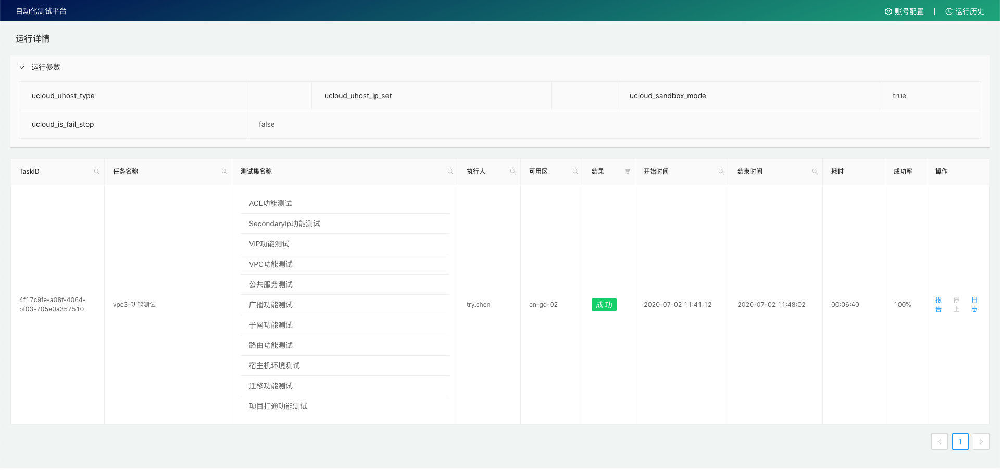
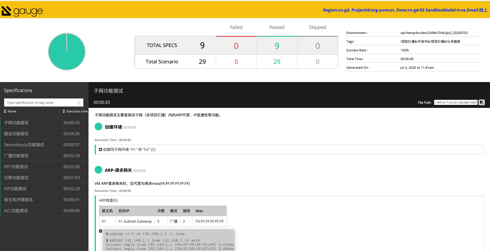
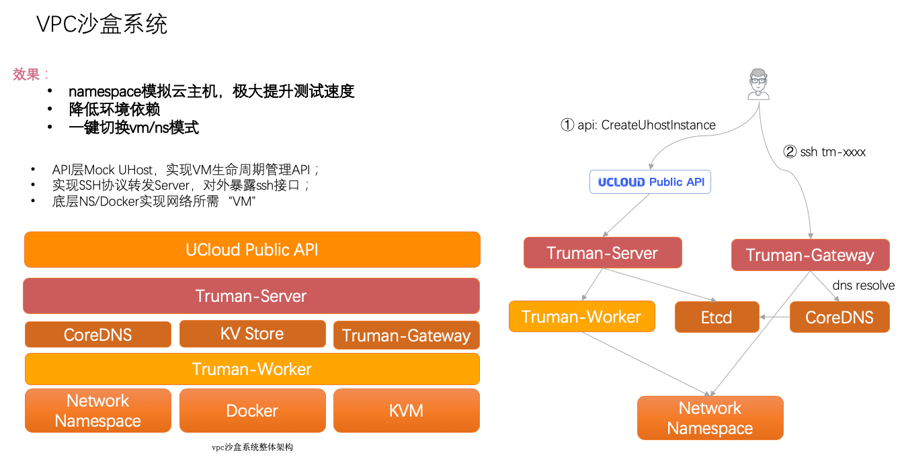
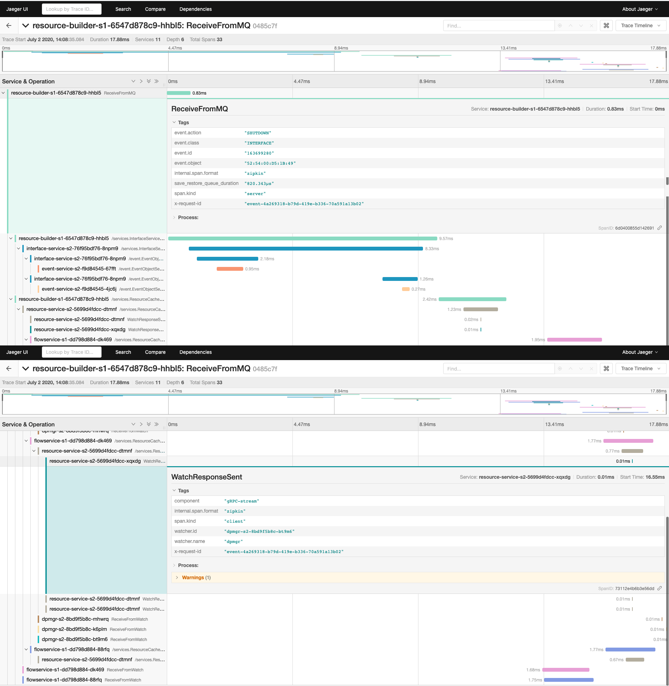
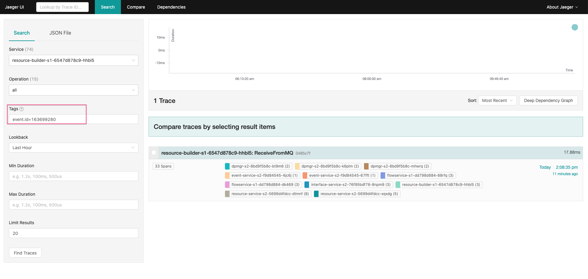
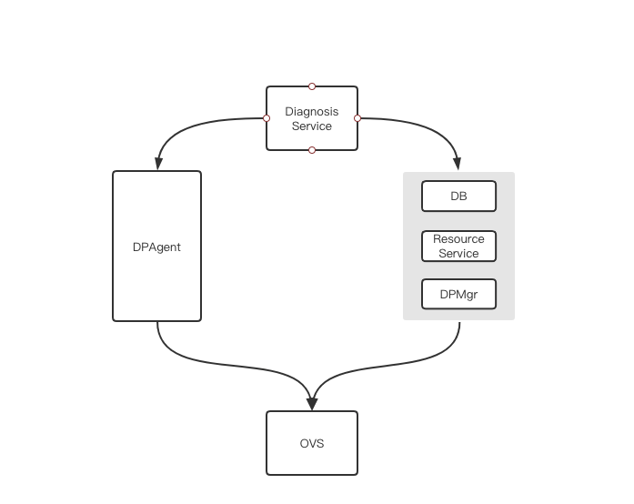
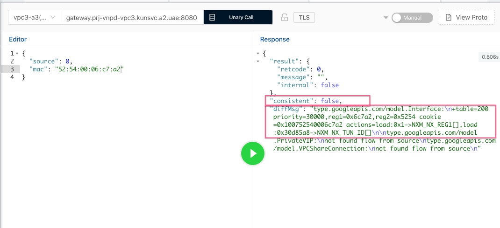

# VPC3.0系列（十一）：线上运营

<p align="right"><font color=Grey>try.chen 2020-10-21</font></p>

> VPC2.0时代我们最熟悉的就是黑屏操作，登录机器、查看日志、重启服务等，而VPC3.0设计之初就希望后续的运营能做到白屏、自动化和智能化，有Sigcomm 2019上阿里云”齐天“的珠玉在前，VPC3.0后续的线上运营系统也是长路漫漫。

## 事件诊断系统

由于VPC3控制面是一套全异步系统，因此如何判断事件是否成功处理，如何对于失败的事件进行自愈，如何衡量和评估系统的健康状况是系统健壮性和可观测性的重中之重。为此，我们设计和开发了事件诊断系统。

事件诊断系统的基本功能如下：

- watch在MQ上监听所有事件，验证期望的flow在所有相关宿主机上的推送情况，包括耗时、flow正确性和完整性，并将结果存储在数据库中；

- 通过探针的方式在resource-service和dpmgr集群中埋点，并记录每个事件和探针的接受情况；

- 对于检测失败的事件会进行一定策略的重放；

- 解析事件对应的OpenTracing链接，并记录在数据库中；

- 支持检测事件（对象）在redis中的正确性，包括model对象和bridgeObject对象；

- 支持检测事件（对象）在dpmgr内存中的正确性，包括bridgeObject对象；

事件诊断系统的使用方式如下。

### 事件查询

`事件查询`可以选择`查询近期事件`来实时观察最近事件的处理情况，也可以选择`查询指定事件`来根据事件Id(整数值,也即版本号)，`状态过滤`支持按照检测状态码来过滤事件，比如常见的有：

- CEC_Blacklist_Event：事件类型在黑名单中，不支持检测，如EIP事件；

- CEC_No_Scopes: 事件查找不到应推送的宿主机列表，如新创建子网事件；

- CEC_Object_NotFound: 事件对象在数据库中查找不到，常见于一些无效事件；

`耗时范围`支持按照事件推送耗时来查找（该耗时准确来说是检测到flow下发的耗时，检测以3s为间隔，持续检测一分钟），`时间范围`按照事件发生时间来过滤，默认为最近一小时。

此外还支持`高级查询`，高级查询支持按照事件的如下字段来过滤：AccountId、VpcId、SubnetId、ObjectId。这些字段是否能正确的检索到事件，取决于发送方是否按照要求来发发送事件，不过绝大部分场景下都是符合规范的。


在事件列表中可以看到事件的整体情况，包括事件信息和版本、处理结果和成功率、推送数量和重试次数以及耗时等，通过详情可以看到更详细的结果，如：


其中，详细解释如下：

- Flow检测：flow推送状态检测；

- OpenTracing状态：通过事件是否能正确解析事件对应的jaeger链接；

- BB检测：BB检测状态，暂未实现；

- 派生事件ID：对于失败的事件会进行重放，此处记录的即为重复的事件ID；

- Dpmgr探针：Dpmgr埋点的探针检测情况，暂未开启；

- Resource探针：Resource-Service埋点的探针检测情况

- 事件详情：详细的事件信息，主要为`t_network_event`表中记录的情况；该详情中的字段会超链接到`实例查询`系统；

- 检测事件：事件的开始检测时间；

- 刷新：刷新该详情页；

- OpenTrace：打开该事件对应的jaeger链接；

- 重放事件：重新发送该事件；

- 诊断该事件：通过`事件诊断`系统 来诊断事件的处理过程；

- IP：推送的宿主机IP列表；

- 业务状态：宿主机IP对应的CMDB Usage；

- 处理状态：检测是否结束；

- 结果：成功/失败，标识flow是否成功下发和检测；

- 成功率：单个宿主机的多个对象推送成功率；

- 推送数量：n/m表示成功推送对象数量/需要推送对象数量；

- Cookie：此次推送的对象Id；

- 对象类型：该cookie对应的BridgeObject对象类型；

- Flow数量：该对象对应的flow数量；

此外，依然可以打开对象对应的详情页，如：


其中`预期`即为理论应该推送的flow，`缺失`和`多余`即为在出现不符时的diff结果。

### 事件诊断

事件诊断会诊断事件（对象）在redis、dpmgr中的内存是否和数据库一致，并诊断flow推送到所有宿主机是否成功。示例如下：


其中可以通过详情和对比发现异同：


redis诊断除model对象外，也支持bridgeObject对象的诊断，如：


通过对比也可以发现flow的差异：


除redis诊断外，还支持dpmgr内存诊断，以发现诸如部分dpmgr节点数据异常：


此外推送诊断也会进行flow的推送诊断，以此发现是否存在某些宿主机、或某些对象推送失败的情况。


### TODO

- [ ] 支持诊断dpmgr-dpagent推送失败

- [ ] 一键诊断支持递归诊断

- [ ] 支持dpmgr探针埋点


其中支持dpmgr-dpagent思路如下：

- 判断watcher是否存在（是否连接到dpmgr）

- 判断mac是否上报到dpmgr（如果存在）

- 判断is_related是否相关

- 判断subnet/vpc等是否存在


## 自动测试系统

通过和测试部门的合作，目前VPC3.0已经上线UT自动测试系统，用于功能测试、回归和拨测等。





## 

通过VPC沙盒系统，提升测试速度，减少环境依赖。



## 运营系统

VPC3.0设计的运营系统参考 [VPC3.0运维系统原型](https://ushare.ucloudadmin.com/pages/viewpage.action?pageId=28398450)。

### 服务管理

VPC3.0中的核心服务都提供了运维接口，用于问题排查和信息查询等，后续将提供控制台查询方式。

### Flow管理

在VPC3.0下将不再需要黑屏登录服务器完成flow的管理和运营，我们提供了Flow的增删改查等API，用于白屏化的操作。

### 事件追踪

目前事件追踪我们是基于原生的OpenTracing系统来完成，能追踪事件处理的整条流程直到DPMgr，然而从DPMgr再到DPagent就暂时没法依靠trace系统来追踪了，tracing系统的细节可以参考： [VPC3.0系列（八）：可观测性](http://doc.vpc.ucloudadmin.com/#/vpc3/VPC3.0%E7%B3%BB%E5%88%97%EF%BC%88%E5%85%AB%EF%BC%89%EF%BC%9A%E5%8F%AF%E8%A7%82%E6%B5%8B%E6%80%A7?id=vpc30%e7%b3%bb%e5%88%97%ef%bc%88%e5%85%ab%ef%bc%89%ef%bc%9a%e5%8f%af%e8%a7%82%e6%b5%8b%e6%80%a7)。



> 可参考该链接：[Jaeger UI](http://80.jaeger-query.prj-vnpd-vpc3.svc.a2.gw.ucloudadmin.com/trace/0485c7f5a4fe527e)

trace系统可以通过某个事件的uuid（形如event-xxxx)、事件版本号来完成查询，对于快速判断整个链路的处理时延、处理栈非常有效。

#### 查询方式

目前支持如下两种方式进行事件查询：

- 根据事件版本号来查询（事件表中的主键id）：
  
  ```python
  event.id=163699280
  ```

- 根据事件对象来查询（事件表中的event_object)：
  
  ```python
  event.object="52:54:00:D5:1B:49"
  ```

- 根据事件request_uuid来查询（事件表中的request_uuid)：
  
  ```python
  event.x-request-id="event-CC21C25F-AD79-40D2-B67C-F26613E246E4"
  ```

- 根据事件class和action来查询
  
  ```python
  event.class="INTERFACE" event.action="CREATE"
  ```

- 以上关系都可以组合

示例：



#### 后续优化

后续trace系统将提供追踪事件具体发送给了哪些DPAgent，并展示其中的时延和成功率。

### Flow诊断

由于VPC3.0的转发面Flow异常复杂（不服的可以看这次[trace记录](http://192.168.152.143:8000/static/ops/trace.txt)），因此开发了`Flow诊断`系统用于快速定位转发面Flow是否正常，用于在处理问题时快速定位，而无需明白具体的flow细节。

Flow诊断的原理是`DiagnosisService`提供的诊断能力：其会通过`DPAgent`提供的`DumpFlow`接口，从ovs拿到最新的flow作为集合A，同时根据数据库中的最新信息构建成期望的flow作为集合B，并比较A和B的内容来判断flow是否符合预期，这其中的难点在于：*如何比较A和B的flow是否一致？*

直接实现Flow的比较无疑是复杂的，为此我们在KUN上部署了ovs的容器，并借助容器中的`ovs-ofctl diff-flows`命令利用ovs来完成原生的flow对比，以此发现flow的异同。



此外，集合B除了来源于数据库之外，还支持来源于`resource-service`、`dpmgr`等组件，以此可以在flow异常时，判断哪一层缓存存在异常。

API截图：



入参为mac地址，`DiagnosisService`会自动解析出mac对应的所有关联对象（如Interface、Subnet、VPC、RouteTable、Pipeline等），并通过`FlowFactory`翻译成flow，因此该集合包含了所有控制面应该下发的、推送的flow。

除了控制面生产的flow之外，`DiagnosisService`也即将会支持对比那些由`DPAgent`自己生产和管理的flow，如Mac/Port校验flow、本地datapath flow、入向广播flow等。

**总结**

对于`Flow诊断`发现的问题，我们会通过事件重放来重新推送，直到转发面下发完整的对象和flow。

### 事件重放

由于VPC3.0后端系统是全链路幂等的，因此对于转发面、控制面遇到的任何问题都可以通过事件重放来解决。

`OPService`将提供基于时间区间内的事件重放功能，用于在发生控制面或转发面异常（如rs离线、推送超时）时将故障时间前后的事件重新推送一遍，触发转发面重新推送和更新。

## 巡检和对账

目前对于BridgeOBject对象有定期对账，用于在数据库和Resource-Service（redis）间完成数据的对账和更新。

此外还有如下对账：

- DPAgent和ovs保持`10m`周期的全量对账；

- DPAgent和DPMgr会保持`300s`周期的全量对账，以及`10s`的版本号校验；

- DPMgr和Resource-Service将会保持`1h`周期的全量对账；

巡检目前仍在设计和考虑，计划使用BB完成黑盒巡检和数据验证，目前暂无详细设计方案。

## 容灾和降级

### KUN极端故障

鉴于KUN的不可靠，计划在KUN不可用时提供两种容灾和降级方案：

- **服务跨地域部署：** 北京二的控制面除了部署在北京二的KUN上，会同时部署一套在上海二的KUN，防止单地域KUN出现极端故障；

- **KUN下部署:** 北京二的控制面在KUN上部署一套，KUN下部署一套。由于两套管理成本较高，考虑KUN下只部署核心服务（dpmgr、event-service）；

### DPMgr容灾和降级

由于DPMgr管理了转发面所有flow对象，因此重要性不言而喻，对此我们提供了多种保护方案：

- 延时集群：[延时集群](http://doc.vpc.ucloudadmin.com/#/vpc3/VPC3.0%E7%B3%BB%E5%88%97%EF%BC%88%E4%B8%83%EF%BC%89%EF%BC%9A%E6%8B%93%E6%89%91%E8%A7%A3%E6%9E%90%E5%92%8C%E6%8E%A8%E9%80%81?id=%e5%bb%b6%e6%97%b6%e9%9b%86%e7%be%a4)

- 延时内存：[延时备份](http://doc.vpc.ucloudadmin.com/#/vpc3/VPC3.0%E7%B3%BB%E5%88%97%EF%BC%88%E4%B8%83%EF%BC%89%EF%BC%9A%E6%8B%93%E6%89%91%E8%A7%A3%E6%9E%90%E5%92%8C%E6%8E%A8%E9%80%81?id=%e6%8c%81%e4%b9%85%e5%8c%96%e5%86%85%e5%ad%98%e6%95%b0%e6%8d%ae%e5%92%8c%e5%bb%b6%e6%97%b6%e5%a4%87%e4%bb%bd)

- 内存持久化：[内存持久化](http://doc.vpc.ucloudadmin.com/#/vpc3/VPC3.0%E7%B3%BB%E5%88%97%EF%BC%88%E4%B8%83%EF%BC%89%EF%BC%9A%E6%8B%93%E6%89%91%E8%A7%A3%E6%9E%90%E5%92%8C%E6%8E%A8%E9%80%81?id=%e6%8c%81%e4%b9%85%e5%8c%96%e5%86%85%e5%ad%98%e6%95%b0%e6%8d%ae%e5%92%8c%e5%bb%b6%e6%97%b6%e5%a4%87%e4%bb%bd)
