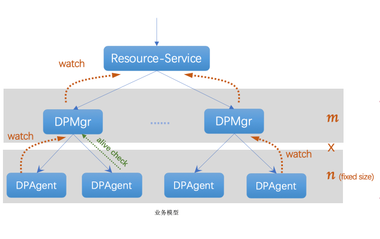
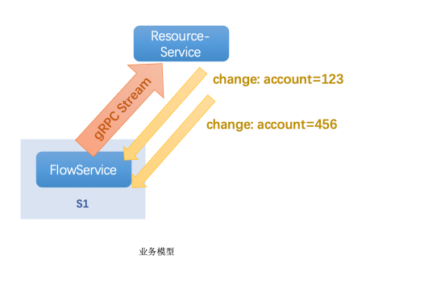

# VPC3.0系列（四）：规模和性能

try.chen 2020-06-18

> 从VPC2.0切换到VPC3.0最大的区别在于flow的下发方式变更了，从此前的按需下发到fullmesh预先下发，如何保证性能是最大的问题。

## 推送规模

按照设计目标，单个变更推送20w台宿主机(DPAgent)，如何保证推送性能？

抽象业务模型如下：

`DPAgent`主动watch在`DPMgr`上接受更新，`DPMgr`主动watch在`Resource-Service`上接受更新。

### 集群无状态设计

#### DPMgr无状态

对于VPC3.0的推送机制来说，`DPMgr`承担了核心角色。其会负责管理连接上来的所有`DPAgent`，并负责变更时的拓扑解析和推送，以及维护内存缓存和`Resource-Service`之间的同步，并负责和DPAgent的全量对账。

对于设计目标高效推送20w个网元来说，必须依赖DPMgr的水平扩容来降低单个DPMgr管理的DPAgent规模以及推送的规模，因此要求DPMgr必须是无状态设计，所以每台DPMgr都拥有region内的全量转发数据并缓存在内存中，底层的DPAgent可以根据K8S的调度落到任意一台DPMgr上都可正常工作。

对于DPMgr来说，其全增量信息都来自于Resource-Service，所以只需要所有的节点都watch在Resource-Service上接受所有变更即可。

##### 全量数据维护

由于DPMg内存中需要维护转发面全量数据，因此此处的可靠性是重中之重。目前有如下机制：

- 全量更新访问保护：基于K8S readiness/liveness probe机制，只有当收到Resource-Service的全量更新之后，才会将readiness探针至于alive状态，允许K8S将来自DPAgent的watch流量调度上去，否则将不允许访问该DPMgr。这是因为如果DPMgr内存中的数据如果不完整，会导致DPAgent与其对账时删除转发面的数据，导致连通性中断；

- 全量对账：DPMgr会周期性的和Resource-Service进行基于版本号的全量对账，以此来保证内存和Resource-Service的一致；

- Keepalive Check：DPAgent会通过和DPMgr建立的watch信道发送keepalive信息，该消息中会携带DPAgent当前处理的版本号，而DPMgr会校验该版本号是否会最新，否则会增量推送版本号之间的差值，也就是其丢失的、关心的事件，以此来触发DPAgent更新到最新版本，类似于binlog同步的原理；

- 全量更新保护：如果Resource-Service返回了对象为空的全量更新，则该全量更新总是会被DPMgr拒绝，以此防止redis集群被清空带来的全量数据丢失问题；

同时，还有如下方案待探讨和实现：

- DPMgr通过PVC周期性持久化内存数据，以此优化宕机后快速拉起时的恢复间隔，同时也可避免Resource-Service或数据层的异常导致的BridgeObject丢失问题；

- DPMgr建立快照集群（内存），其数据延迟正常集群若干分钟，用于在极端故障时的快速切换，相当于整体转发面数据回滚到前十分钟的状态，用于降级服务从极端故障中快速恢复；

###### 为什么DPMgr不分片

DPMgr借助于Resource-Service是有分片的能力，且分片中绝大部分场景是可以按照account粒度来切分。但尴尬的是，虚拟网络中有种产品叫“项目打通”，意味着多个account之间可能是彼此关联的，因此他们必须落在同一个分片上，而这会使的问题变得异常复杂，因此DPMgr暂时不支持分片。

#### Resource-Service无状态

Resource-Service同样需要可以实现水平扩容，因此Resource-Service的状态有两种机制来处理：

- 业务数据外放在统一的redis主备集群中，Resource-Service本身不存储任何业务数据，状态通过集中存储来保存；

- 对于Resource-Service自己所需的状态信息（如subject meta/index）通过MQ扩散给集群内的所有Resource-Service节点，大家就subject信息达成一致，使得每个节点都拥有全量状态数据；

### vport注册优化

在此前VPC2.0的逻辑中，对于vm创建时对应的vport总是需要agent(UNet3Agent)周期性上报到控制面(UNet3Manager)之后，控制面才能根据这个vport下发新的flow，而该上报是周期性的，在迁移等场景中虽然会主动触发端口上报但总需要等待N次网络RPC的时间，也是迁移中断的诸多罪魁祸首之一。

而在VPC3.0的设计中，对于mac和port的对应关系控制面不再关心，控制面生产的所有flow都不带有port信息，而mac和port的相关flow（如mac/port校验、本地output入向flow）全都由转发面（DPAgent）自己生产和管理，因此port信息对于VPC3.0来说无需上报到控制面，可以实现控制面flow的更快下发。

同时对于一个vm（也即一个mac）来说，其通过哪个DPAgent接入DPMgr也是无状态的，只要该vport通过DPAgent注册到DPMgr中后，DPAgent就会立刻下发该vport关心的所有flow，甚至不需要该vport上报到控制面，因此我们解决了迁移优化中的核心延时：

> t1时刻：目的宿主机创建vm'，状态处于pause，同时创建vport；
> 
> t2时刻：目的端vport被DPAgent注册到DPMgr，立刻拉取到所有相关flow；
> 
> t3时刻：目的端vm'进入running的瞬间，目的宿主机上的flow已经全都具备，流量可以立刻转发而无需下发任何flow；
> 
> t4时刻：unlock时下发relay flow，通知源端中转，此时通信恢复正常；
> 
> t5时刻：unlock触发端口上报，产生事件之后控制面更新所有源端flow

### 分层设计 水平扩容

通过以上无状态设计，使得推送关键链路上的服务都可以通过横向扩容来解决性能问题。而通过Resource-Service和Dpmgr两层设计，使得Resource-Service只需要负责服务间的对象路由，该层复杂度始终为O(1)，而单台DPMgr管理固定数据DPAgent，业务模型较为固定，推送波动小，扩缩容的基线明确，复杂度始终为O(n)。

对于推送的规模问题，总是能通过水平扩容DPmgr来解决。

#### Redis性能隐患

尽管DPMgr和Resource-Service可以做到无状态扩容，但Resource-Service依赖的Redis仍然存在性能隐患。

目前我们的redis采用的是主备节点哨兵模式，之所以没有采用集群模式，是因为：

- 我们使用的pipeline、eval等命令均不支持集群模式（除非自己制定hash key）；

- 集群模式非强一致；

而主备模式存在的性能问题就是，常态情况下只有master节点会接受请求，而slave完全处于冷备状态，因此master节点的处理性能是整个系统的上限。而对于这个问题，我们也有针对性的解法，但仍然都各有利弊：

- 修改redis-client-sdk，使得sentinel返回slave节点ip，sdk库中进行主从分离。优点：分散请求，平衡集群性能；缺点：主从同步延迟、主从切换时数据丢失；

- 去除eval等依赖，使用cluster模式，分散请求，缺点是数据非强一致，可能会出现丢失的情况；

### 隔离故障域

隔离故障域的手段主要有：

- DPMgr按照DPAgent实现go-routine级别隔离，单台宿主机推送异常不影响其他宿主机；

- DPAgent更新flow时按照cookie隔离，单个vm flow推送异常时不影响其他vm；

- DPMgr/FlowService分片等；

#### 性能和风险的平衡

在DPAgent的实践中，如果按照cookie隔离去更新ovs会导致整体的更新效率非常低，更新3w条flow大约需要160s。因此为了优化性能，DPAgent会对flow进行聚合，通过`--bundle`来原子更新ovs，以此将性能提升到了600ms，但带来的问题就是如果其中的某些flow失败，会导致这次整体更新全部回退，因此这也是性能和风险的平衡。

目前我们的方案是，对于聚合处理失败的flow，退化为按照cookie单个处理，以此保证绝大部分情况下性能优先，出现问题时牺牲性能降低最小故障域。

## 事件频率

按照设计目标，每秒4000个变更（事件），如何保证性能？

对于变更频率，主要问题在于flowservice和DPMgr从Resource-Service Watch对象时的处理性能，这一部分没法直接通过水平扩容来处理，因为直接扩容的的话，多个节点都会watch到相同的事件，并且重复处理、重复更新，不仅起不到水平扩容、负载均衡的能力，返回将降低整个系统的TCO。

因此对于事件频率的优化，我们可以直观的看到每个事件都是属于不同用户的（account），如果对于事件可以按照account来分片，那么就可以通过水平扩容解决这个问题，这个问题我们将在第五部分专门讨论。

